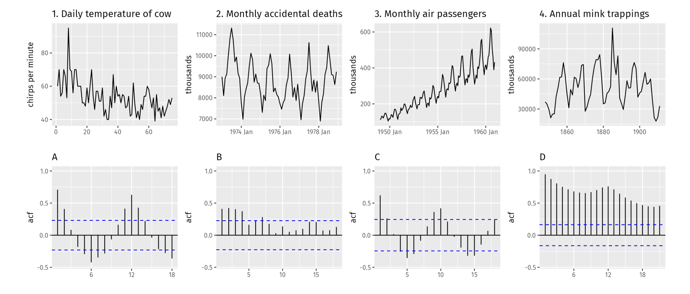

```{r Setup, include = F}
options(htmltools.dir.version = FALSE)
library(pacman)
p_load(broom, latex2exp, ggplot2, ggthemes, ggforce, viridis, dplyr, magrittr, knitr, parallel, xaringanExtra, tidyverse, sjPlot, showtext, mathjaxr, ggforce, furrr, kableExtra, wooldridge, hrbrthemes, scales, ggeasy, patchwork, janitor, tsibble, lubridate)


# Knitr options
opts_chunk$set(
  comment = "#>",
  fig.align = "center",
  fig.height = 7,
  fig.width = 10.5,
  warning = F,
  message = F,
  dpi=300
)

theme_set(theme_ipsum_rc())

```

```{R, colors, include = F}
# Define pink color
red_pink <- "#e64173"
turquoise <- "#20B2AA"
orange <- "#FFA500"
red <- "#E02C05"
blue <- "#2b59c3"
green <- "#0FDA6D"
grey_light <- "grey70"
grey_mid <- "grey50"
grey_dark <- "grey20"
purple <- "#6A5ACD"
```


# Materials

<br><br>

.b[Required readings]:

<br>

  - [`Hyndman & Athanasopoulos, ch. 2`](https://otexts.com/fpp3/graphics.html)
  
    


---
class: inverse, middle

# Motivation


---

# Motivation

So far, we have studied *three* types of time-series .hi-blue[visualization] techniques:

--

<br>

  - *Time* plots;
  
  - *Seasonal* plots;
  
  - *Scatter* plots.
  
--

<br><br>

There is *more* to explore, and we will study further techniques that can give important .hi-red[insights] about the relevant .hi-slate[features] of our time series.

---
class: inverse, middle

# Autocorrelation

---

# Autocorrelation

Before the next plots, we must clarify what a .hi-red[lag] means:

--

  > In time series jargon, the number of .hi[time steps] between a series' observations is known as a .hi-slate[lag].
  
--

<br>

In terms of .b[notation], we will use the subscript *t* to denote a .hi-blue[time index].

--

  - For instance, given a time series called *y*, its value at time *t* can be denoted by *y<sub>t</sub>*.


In case we want to denote the value of time series *y* .b[one step in the past], we will write this as *y<sub>t-1</sub>*.

--

Similarly, for any step *k* in the past, we can denote such value by *y<sub>t-k</sub>*.


--

Such steps must be consistent with the .hi-slate[frequency] of the time series (e.g., monthly, quarterly, daily, yearly, etc.)


---

# Autocorrelation

One key feature of time-series data is that .hi-red[past] values usually help to explain .hi[present] and/or .hi[future] values.

--

Therefore, values of a time series in the *past* may be .hi-blue[correlated] with more *recent* observations.

--

<br>

More formally, for a given *k* value, *y<sub>t-k</sub>* and *y<sub>t</sub>* may share a *nonzero* correlation coefficient.

<br>

--

Just as .hi-red[correlation] measures the extent of a *linear* relationship between two variables, .hi-blue[autocorrelation] measures the linear relationship between *lagged values of a time series*.

---

# Autocorrelation

.pull-left[The sample .hi-red[autocovariance] at lag *k* of a time series *y* is given by

$$
\begin{aligned}
c_k = \dfrac{\displaystyle\sum_{t=k+1}^{T}(y_t - \bar{y})(y_{t-k} - \bar{y})}{T}
\end{aligned}
$$
]
--

.pull-right[

The .hi-blue[variance] of *y* is given by

$$
\begin{aligned}
\text{Var}(y) = \dfrac{\displaystyle\sum_{t=1}^{T}(y_t - \bar{y})(y_{t} - \bar{y})}{T}
\end{aligned}
$$
]

--

<br><br>

And the .hi-slate[autocorrelation coefficient] at lag *k* is given by

$$
\begin{aligned}
r_k = \dfrac{c_k}{\text{Var}(y)}
\end{aligned}
$$

---
class: inverse, middle

# Lag plots

---

# Lag plots

<br>

.hi[Lag plots] display the data plotted against its different .hi-blue[lags] in a scatter plot.

--

<br>

Different .hi-slate[colors] correspond to each period (*vertical axis*) against lagged values (*horizontal axis*).

--

<br>

In case the time series shows .hi-red[seasonality], the autocorrelation coefficient will be .b[large] and .b[positive] at the .hi-blue[multiples] of the seasonal period.

  - e.g., 12 lags for *monthly* data; 4 lags for *quarterly* data, and so on.

---

# Lag plots

```{r, message=FALSE, dev = "svg", warning=FALSE, fig.height=6, echo=FALSE}

air <- read_csv("https://raw.githubusercontent.com/selva86/datasets/master/AirPassengers.csv")


air |> 
  #mutate(date = yearmonth(date)) |> 
  ggplot(aes(x = date, y = value)) +
  geom_line() +
  scale_x_date(date_breaks = "2 years", date_labels = "%b %Y") +
  labs(title = "International airline passengers",
       subtitle = "Jan 1949 – Dec 1960",
       caption = "Source: Brown (1962).",
       x = "",
       y = "Thousands")

```

---

# Lag plots


```{r, message=FALSE, dev = "svg", warning=FALSE, fig.asp=.55, echo=FALSE}
air |> 
  mutate(date = yearmonth(date)) |> 
  as_tsibble(index = date) |> 
  gg_lag(value, geom = "point",
         lags = 1:2) +
  labs(y = "Thousands of passengers",
       title = "Lag plot: Airline passengers")

```

---

# Lag plots


```{r, message=FALSE, dev = "svg", warning=FALSE, fig.asp=.55, echo=FALSE}
air |> 
  mutate(date = yearmonth(date)) |> 
  as_tsibble(index = date) |> 
  gg_lag(value, geom = "point",
         lags = c(1, 12, 24)) +
  labs(y = "Thousands of passengers",
       title = "Lag plot: Airline passengers")

```

---

# Lag plots

```{r, echo = FALSE}
air_passengers <- air |> 
  mutate(date = yearmonth(date)) |> 
  as_tsibble(index = date)

```

```{r, message = FALSE}
air_passengers |> 
  ACF(lag_max = 12)

```


---

# Lag plots


```{r, message=FALSE, dev = "svg", warning=FALSE, fig.height=6, echo=FALSE}
air |> 
  mutate(date = yearmonth(date)) |> 
  as_tsibble(index = date) |> 
  gg_lag(value, geom = "point",
         lags = 1:12) +
  labs(y = "Thousands of passengers",
       title = "Lag plot: Airline passengers")

```


---

# Lag plots


```{r, message=FALSE, dev = "svg", warning=FALSE, fig.height=6, echo=FALSE}
beer <- aus_production |> 
  select(Quarter, Beer) |> 
  filter(year(Quarter) >= 1992)

beer |> 
  autoplot() +
  labs(title = "Australian beer production",
       subtitle = "1992Q1–2010Q2",
       y = "Megaliters",
       caption = "Source: Hyndman and Athanasopoulos (2021).")

```

---
class: clear


```{r, message=FALSE, dev = "svg", warning=FALSE, fig.asp=.65, echo=FALSE}
beer <- aus_production |> 
  select(Quarter, Beer) |> 
  filter(year(Quarter) >= 1992)

beer |> 
  gg_lag(geom = "point", lags = 1:8) +
  labs(title = "Lag plot: Australian beer production",
       subtitle = "1992Q1–2010Q2",
       y = "Megaliters",
       caption = "Source: Hyndman and Athanasopoulos (2021).")
```


---

# Lag plots

```{r}
beer |> 
  ACF(lag_max = 8)
```


---
class: inverse, middle

# The autocorrelation function


---

# The autocorrelation function

A more .hi-red[insightful] way to observe the autocorrelation coefficient is through the .hi-blue[Autocorrelation Function (ACF) plot].

--

It simply plots together the *values* of the .hi[autocorrelation coefficient] against different *lags.*

```{r, message=FALSE, dev = "svg", warning=FALSE, fig.height=4, echo=FALSE}
beer |> 
  ACF(lag_max = 8) |> 
  autoplot() +
  labs(title= "ACF plot: Australian beer production",
       y = "Autocorrelation coefficient") +
  scale_x_continuous(breaks = seq(0,8,1))
```


---

# The autocorrelation function

.pull-left[
```{r}
beer |> 
  ACF(lag_max = 8)
```
]

.pull-right[
```{r, message=FALSE, dev = "svg", warning=FALSE, fig.asp=.5, echo=FALSE}
beer |> 
  ACF(lag_max = 8) |> 
  autoplot() +
  labs(title= "ACF plot: Australian beer production",
       y = "Autocorrelation coefficient") +
  scale_x_continuous(breaks = seq(0,8,1))
```
]
---

# The autocorrelation function

An autocorrelation function plot is also known as .hi-blue[correlogram].

```{r, message=FALSE, dev = "svg", warning=FALSE, fig.height=5, echo=FALSE}
air_passengers |> 
  ACF(lag_max = 12) |> 
  autoplot() +
  labs(title = "ACF plot: International airline passengers",
       y = "Autocorrelation coefficient") +
  scale_x_continuous(breaks = seq(0,12,1))
```


---

# The autocorrelation function


```{r}
air_passengers |> 
  ACF(lag_max = 12)
```


---

# The autocorrelation function

The ACF plot may show interesting patterns, depending on the .hi-slate[features] of the time series.

--

- When data have a .hi-red[trend], the autocorrelations for *small* lags tend to be .b[large] and .b[positive].

  - Observations nearby in time are *also* nearby in value!
  
--

<br>

- When data are .hi-blue[seasonal], the autocorrelations will be *larger* for the *seasonal* lags (at multiples of the seasonal period) than for other lags.

--

<br>

- When data are both .hi-red[trended] and .hi-blue[seasonal], the ACF plot usually shows a .b[combination] of the above effects.


---

# The autocorrelation function

.center[

]

---

# The autocorrelation function

<br><br><br>

[`A different look at the autocorrelation function, by Alison Horst`](https://allisonhorst.com/time-series-acf)


---
class: inverse, middle

# White noise

---

# White noise

Some time series may *not* show autocorrelation .hi-blue[at all].

--

When this is the case, they are called .hi-red[white noise].

--

> A time series *w<sub>t</sub>* is defined to be .b[white noise] if its observations are *identically and independently distributed* (i.i.d.) with a *mean* of zero and constant *variance.*

--

```{r, message=FALSE, dev = "svg", warning=FALSE, fig.height=3.5, echo=FALSE}

set.seed(68)
y <- tsibble(sample = 1:66, wn = rnorm(66), index = sample)
y |> autoplot(wn) + labs(title = "White noise series", y = "", x = "time")

```

---

# White noise

```{r, message=FALSE, dev = "svg", warning=FALSE, fig.height=5, echo=FALSE}

y |> 
  ACF() |> 
  autoplot() +
  labs(title = "ACF plot of white noise data",
       y = "Autocorrelation coefficient")

```

---
layout: false
class: inverse, middle

# Next time: Time series decomposition

---
exclude: true