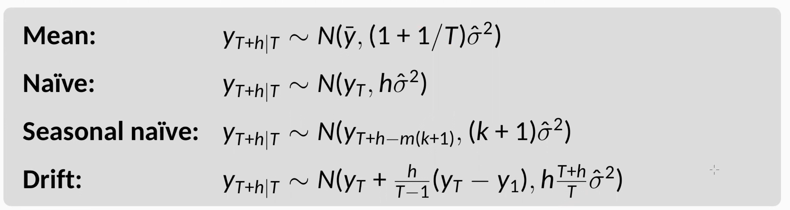

```{r Setup, include = F}
options(htmltools.dir.version = FALSE)
library(pacman)
p_load(broom, latex2exp, ggplot2, ggthemes, ggforce, viridis, dplyr, magrittr, knitr, parallel, xaringanExtra, tidyverse, sjPlot, showtext, mathjaxr, ggforce, furrr, kableExtra, wooldridge, hrbrthemes, scales, ggeasy, patchwork, janitor, tsibble, lubridate, fpp3, MetBrewer)


# Knitr options
opts_chunk$set(
  comment = "#>",
  fig.align = "center",
  fig.height = 7,
  fig.width = 12.5,
  warning = F,
  message = F,
  dpi=300
)

theme_set(theme_ipsum_rc())

```

```{R, colors, include = F}
# Define pink color
red_pink <- "#e64173"
turquoise <- "#20B2AA"
orange <- "#FFA500"
red <- "#E02C05"
blue <- "#2b59c3"
green <- "#0FDA6D"
grey_light <- "grey70"
grey_mid <- "grey50"
grey_dark <- "grey20"
purple <- "#6A5ACD"
```


# Materials

<br><br>

.b[Required readings]:

<br>


  - [`Hyndman & Athanasopoulos, ch. 6`](https://otexts.com/fpp3/residuals.html)
  
    - sections 6.3&mdash;6.4.
  
  
    


---
class: inverse, middle

# Motivation


---

# Motivation

<br>

After introducing the four .hi-red[benchmark] forecasting models, we will focus on what is .hi[left over] after fitting a forecasting model.

--

Analogous to a .hi-blue[regression model], even the best models .hi-red[cannot] explain the entire variation exhibited by a variable of interest.

--

In our case, the .hi[fitted/estimated] values of a variable $(\hat{y}_t)$ reflect our .hi-red[best effort] to predict the future values of a variable of interest.

--

More formally, a forecasting model's .hi-slate[residuals] $(e_t)$ are equal to the *difference between the observations and the corresponding fitted values*: 


$$
\begin{aligned}
e_t = y_t - \hat{y}_t
\end{aligned}
$$


---
class: inverse, middle

# Residual diagnostics

---

# Residual diagnostics


<br>

.hi[Residuals] are useful in checking whether a model has *adequately captured* the information in the data.

--

<br>

One thing that we .hi-red[do not] want to observe in a forecasting model's residuals are .hi[visible patterns].

--

<br>

Thus, we need to learn some .hi-blue[tools] that can help us in exploring some possible patterns.

---

# Residual diagnostics

Forecasting residuals should exhibit .hi-red[two] main *properties*:

--

<br>

  1. .b[No autocorrelation]:
  
    - The presence of autocorrelation in a model's residuals implies that **useful information** that the model has ignored.
    
  2. .b[Zero mean]:
  
    - On average, what is left out of our explicit model should not have a value different than zero. Otherwise, our forecasting model may be **biased**.

--

<br>

In the .hi-red[absence] of either (or both) of these properties, our task is to .hi-blue[improve] our forecasting model.

---

# Residual diagnostics

In addition to the two aforementioned properties, *two* .hi-blue[additional] residual features are .hi[desirable]:

--

  1. .b[Constant variance (homoskedasticity)];
  
  2. .b[Normally distributed residuals].


--

<br>

Although not absolutely necessary, satisfying these two additional properties allows for better forecasting .hi-slate[prediction intervals].


---
class: inverse, middle

# An example


---

# An example

```{r, message=FALSE, dev = "svg", warning=FALSE, fig.height=8, echo=FALSE}

dex <- read_csv("DEXUSEU.csv") |> 
  clean_names() |> 
  rename(exch = dexuseu)


dex_ts <- dex |> 
  mutate(exch = as.double(exch)) |> 
  as_tsibble(index = date) |> 
  mutate(day = row_number()) |>
  update_tsibble(index = day, regular = TRUE)


dex_ts2 <- dex_ts |> 
  filter(date > "2023-01-01")

dex_ts2 |> 
  autoplot(linewidth = .7) +
  labs(title = "U.S. Dollars to Euro spot exchange rate",
                               subtitle = "Jan 2023 – Feb 2024 (daily)",
                               caption = "Source: U.S. Federal Reserve System.",
                               y = "U.S. Dollars to 1 Euro",
                               x = "Day number") +
  easy_plot_subtitle_size(13) +
  easy_y_axis_title_size(13) +
  easy_plot_caption_size(13)
```

---

# An example

```{r, message=FALSE, dev = "svg", warning=FALSE, fig.height=8, echo=FALSE}
dex_fit <- dex_ts2 |> 
  model(naive_model = NAIVE(exch))


dex_fc <- dex_fit |> 
  forecast(h = 30)


dex_fc |> 
  autoplot(dex_ts2, color = "#974c90", linewidth = 1.1) + 
  labs(title = "U.S. Dollars to Euro spot exchange rate, Jan 2023 – Feb 2024 (daily)",
       subtitle = "30-day forecast using the naïve method",
       caption = "Source: U.S. Federal Reserve System.",
       y = "U.S. Dollars to 1 Euro",
       x = "") +
  easy_plot_subtitle_size(13) +
  easy_y_axis_title_size(13) +
  easy_plot_caption_size(13)

```

---

# An example

<br>

```{r, echo = FALSE, message = FALSE, warning = FALSE}

dex_aug <- dex_fit |> 
  augment()

dex_aug

```

---
class: clear

# An example

```{r, message=FALSE, dev = "svg", warning=FALSE, fig.height=8.5, fig.width=14, echo=FALSE}
dex_aug |> 
  ggplot(aes(x = day, y = exch)) +
  geom_line(aes(color = "Original data"), linewidth = 0.6) +
  geom_line(aes(y = .fitted, color = "Fitted/Estimated values"), linewidth = 0.9) +
  scale_color_met_d("Veronese") +
  easy_add_legend_title("Series") +
  labs(title = "U.S. Dollars to Euro spot exchange rate, Jan 2023 – Feb 2024 (daily)",
       subtitle = "Fit from the naïve method",
       caption = "Source: U.S. Federal Reserve System.",
       y = "U.S. Dollars to 1 Euro",
       x = "") +
  easy_plot_legend_size(13) +
  easy_plot_subtitle_size(13) +
  easy_y_axis_title_size(13) +
  easy_plot_caption_size(13) +
  easy_legend_at("top")

```


---

# An example

```{r, message=FALSE, dev = "svg", warning=FALSE, fig.height=8, echo=FALSE}

dex_aug |> 
  autoplot(.innov, color = "#1a4146", linewidth = .6) +
  labs(title = "Residuals from the naïve method",
       y = "Residuals") +
  geom_hline(yintercept = 0, linetype = 2) +
  easy_plot_subtitle_size(13) +
  easy_y_axis_title_size(13) +
  easy_plot_caption_size(13)

```


---

# An example

```{r, message=FALSE, dev = "svg", warning=FALSE, fig.height=8, echo=FALSE}

dex_aug |> 
  ggplot(aes(x = .innov)) +
  geom_histogram(color = "white", fill = "#1a4146", alpha = 0.4) +
  labs(title = "Histogram of residuals",
       y = "Count",
       x = "Residuals") +
  easy_plot_subtitle_size(13) +
  easy_y_axis_title_size(13) +
  easy_plot_caption_size(13)

```


---

# An example

```{r, message=FALSE, dev = "svg", warning=FALSE, fig.height=8, echo=FALSE}
dex_aug |> 
  ACF(.innov) |> 
  autoplot() +
  labs(title = "ACF plot of model residuals",
       y = "ACF") +
  easy_plot_subtitle_size(13) +
  easy_y_axis_title_size(13) +
  easy_plot_caption_size(13)

```

---
class: inverse, middle

# Portmanteau tests


---

# Portmanteau tests

Regarding residual autocorrelation, we can complement individual .hi[ACF] analysis by using so-called .hi-blue[Portmanteau] tests.

--

The idea behind such tests is to consider a .hi-red[whole set] of autocorrelation coefficients as a group, rather than testing for autocorrelation at individual lags, as we do in an ACF plot.

--

Thus, we can test whether the first $\mathcal{l}$ autocorrelations are significantly different from what would be expected from a .hi[white noise] process.

--

When we test for autocorrelation in this grouped fashion, we call it a .hi-blue[Portmanteau] test.

--

We will further study .hi-slate[two] of these tests:

  1. The *Box-Pierce* test;
  2. The *Ljung-Box* test.


---

# Portmanteau tests

- .b[The Box-Pierce test]: 


The Box-Pierce test has the following .hi-red[test statistic]:

$$
\begin{aligned}
Q = T\displaystyle\sum_{k=1}^lr_k^2
\end{aligned}
$$

<br>

where *T* is the length of the time series; *l* is the number of lags you consider in the test; and *r* is the autocorrelation coefficient for each lag.

--

<br>

Regarding the .hi[choice of lag] for this test, the textbook authors suggest *l = 10* for *non-seasonal* data and *l = 2m* for *seasonal* data (where *m* is the seasonal period).


---

# Portmanteau tests

- .b[The Ljung-Box test]: 

The Ljung-Box test has the following .hi-red[test statistic]:

$$
\begin{aligned}
Q^* = T(T+2)\displaystyle\sum_{k=1}^l(T-k)^{-1}r_k^2
\end{aligned}
$$

<br>

Compared to the Box-Pierce test, it tends to give .hi-slate[more accurate] results.

--

<br>

For both tests, we assume a .hi[Chi-squared] $(\chi^2)$ distribution with *l* degrees-of-freedom.


---

# Portmanteau tests


As a .hi-blue[null hypothesis], we assume that the *residuals are not distinguishable from a white noise series*.

--

<br>

For our previous example,

```{r, echo = FALSE, message = FALSE, warning = FALSE}

dex_aug |> 
  features(.innov, box_pierce, lag = 10)

dex_aug |> 
  features(.innov, ljung_box, lag = 10)

```

--


<br>

What do we conclude?


---
class: inverse, middle

# Prediction intervals


---

# Prediction intervals

The inherent .hi-red[uncertainty] from any forecast model is expressed by a .hi-blue[probability distribution].

--

The usual way to display forecast results is by showing its (average) .hi-slate[point forecast], along with a .hi[prediction interval].

--

> A .hi[prediction interval] gives an interval within which we expect *y<sub>t</sub>* to lie with a specified probability.

--

<br>

For instance, a 95% prediction interval for an *h*-step forecast is given by 

$$
\begin{aligned}
\hat{y}_{T+h | T} \  \pm 1.96 \hat{\sigma}_h
\end{aligned}
$$

<br>

where $\hat{\sigma}_h$ is the estimated .hi-blue[standard deviation] of the *h*-step forecast distribution.


---

# Prediction intervals

<br>

In general, the prediction interval is obtained by:

$$
\begin{aligned}
\hat{y}_{T+h | T} \  \pm c \hat{\sigma}_h
\end{aligned}
$$

<br>

where the value of *c* depends on the .hi[confidence level] we assume fort the prediction interval.

--

<br>

The usual values are *1.64* for .b[90%]; *1.96* for .b[95%]; and *2.58* for .b[99%].


---

# Prediction intervals

The estimated standard deviation parameter $(\hat{\sigma}_h)$ will have *different* definitions depending on the forecasting .hi-blue[method] we adopt.

--

For our 4 .hi-red[benchmark] methods:

.center[

]


---

# Prediction intervals

For our previous example,

<br>

```{r, echo = FALSE, message = FALSE, warning = FALSE}

dex_fc |> 
  hilo()

```


---

# Prediction intervals


```{r, message=FALSE, dev = "svg", warning=FALSE, fig.height=8, echo=FALSE}

dex_fc |> 
  autoplot(dex_ts2, color = "#974c90", linewidth = 1.1) + 
  labs(title = "U.S. Dollars to Euro spot exchange rate, Jan 2023 – Feb 2024 (daily)",
       subtitle = "30-day forecast using the naïve method",
       caption = "Source: U.S. Federal Reserve System.",
       y = "U.S. Dollars to 1 Euro",
       x = "") +
  easy_plot_subtitle_size(13) +
  easy_y_axis_title_size(13) +
  easy_plot_caption_size(13)

```

---
layout: false
class: inverse, middle

# Next time: Using transformations and decompositions

---
exclude: true


