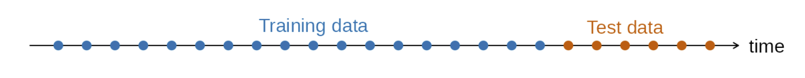

```{r Setup, include = F}
options(htmltools.dir.version = FALSE)
library(pacman)
p_load(broom, latex2exp, ggplot2, ggthemes, ggforce, viridis, dplyr, magrittr, knitr, parallel, xaringanExtra, tidyverse, sjPlot, showtext, mathjaxr, ggforce, furrr, kableExtra, wooldridge, hrbrthemes, scales, ggeasy, patchwork, janitor, tsibble, lubridate, fpp3, MetBrewer)


# Knitr options
opts_chunk$set(
  comment = "#>",
  fig.align = "center",
  fig.height = 8,
  fig.width = 12.5,
  warning = F,
  echo = FALSE,
  message = F,
  dev = "svg",
  dpi=300
)

theme_set(theme_ipsum_rc())

```

```{R, colors, include = F}
# Define pink color
red_pink <- "#e64173"
turquoise <- "#20B2AA"
orange <- "#FFA500"
red <- "#E02C05"
blue <- "#2b59c3"
green <- "#0FDA6D"
grey_light <- "grey70"
grey_mid <- "grey50"
grey_dark <- "grey20"
purple <- "#6A5ACD"
```


# Materials

<br><br>

.b[Required readings]:

<br>


  - [`Hyndman & Athanasopoulos, ch. 6`](https://otexts.com/fpp3/accuracy.html)
  
    - section 6.8.
    
    - sections 6.8 & 6.9 are *optional readings*. 


    
    


---
class: inverse, middle

# Motivation


---

# Motivation

<br>

One of the main challenges when estimating forecasting models is that we are trying to predict .hi-blue[unknown] (future) values of a variable.

--

<br>

We usually do not have the .hi-red[luxury] of *waiting* until we see these future values so we can compare our predictions with the real data.

--

<br>

Fortunately, there are some techniques we can apply so we can evaluate the .hi-orange[accuracy] of our forecasts.


---
class: inverse, middle

# Point forecast accuracy

---

# Point forecast accuracy

The *basic idea* of .hi-red[forecast accuracy] measures is that we can evaluate how well a model performs on .hi[new data] that were .hi[not used] when fitting the model.

--

Given that, the procedure is to .hi-blue[split] the data set into two portions:

  - The **training** set;
  
  - The **test** set.
  
--

<br>

The .b[training] set is used to *estimate* any parameters of a forecasting method, while the .b[test] set is *left out* of the estimation step, being used to evaluate its *accuracy.*

--

The test set, then, should provide a .hi-red[reliable indication] of how well the model is likely to forecast on new data.


---

# Point forecast accuracy

<br>

.center[

]

--

<br>


In terms of the .hi-slate[size of the split], a usual procedure is to leave .b[20%] of the total sample length for the test set.

--

<br><br>

Ideally, the test set should be *as large as the maximum forecast horizon required*. 


---
class: middle, inverse

# Forecast errors

---

# Forecast errors

A .hi-red[forecast error] is the difference between an *observed* value and its *forecast*.

--

Formally, 

$$
\begin{aligned}
e_{T+h} = y_{T+h} - \hat{y}_{T+h \ |\ T}
\end{aligned}
$$

<br>

--

One .hi-blue[crucial] point:

  - **Forecast errors are different from model residuals**!
  
--

<br>

.hi-slate[Residuals] are calculated on the *training* set while forecast .hi-red[errors] are calculated on the *test* set.


---

# Forecast errors

The first category of forecast error measures are the so-called .hi-red[scale-dependent errors].

--

These are located in the same .hi-blue[scale] as the original data (e.g., dollars, persons, percent).

--

The two main scale-dependent error measures are the .hi-red[Mean Absolute Error (MAE)] and the .hi-blue[Root Mean Squared Error (RMSE)].

--

$$
\begin{aligned}
\text{MAE} = \text{mean}(|e_t|)
\end{aligned}
$$

<br>

$$
\begin{aligned}
\text{RMSE} = \sqrt{\text{mean}(e_t^2)}
\end{aligned}
$$

--

<br>

When *comparing* different models, we would like to choose the one that .hi[minimizes] theses errors.


---

# Forecast errors

Another category of forecast errors are .hi-red[percentage errors].

--

These are .hi-blue[unit-free], and thus can be compared across different data sets.

--

The most common percentage error measure is the .hi-blue[Mean Absolute Percentage Error (MAPE)]:

<br>

$$
\begin{aligned}
\text{MAPE} = \text{mean}(|p_t|)
\end{aligned}
$$

where $p_t = 100e_t/y_t$.

--

<br>

One key .b[drawback] of this measure is that it is undefined for data points equal to zero $y_t = 0$.

---

# Forecast errors

The last category involves .hi-red[scaled errors].

--

The main purpose of scaled errors is to provide comparison across different data sets (as with percentage errors), but not having the same issues as the previous two categories.

--

For a .hi-blue[non-seasonal] time series, a useful way to define a scaled error uses *naïve forecasts*: 

$$
\begin{aligned}
q_j = \dfrac{e_j}{\dfrac{1}{T-1}\displaystyle\sum_{t=2}^T |y_t - y_{t-1}|}
\end{aligned}
$$


--

For .hi-red[seasonal data], the formula looks like the following (*m* is the seasonal period):

$$
\begin{aligned}
q_j = \dfrac{e_j}{\dfrac{1}{T-m}\displaystyle\sum_{t=m+1}^T |y_t - y_{t-m}|}
\end{aligned}
$$

---

# Forecast errors

<br>

The value of the error $q_j$ computed by the previous formula is .hi-slate[scale-free].

--

<br>

Then, we are able to calculate the .hi-blue[Mean Absolute Scaled Error (MASE)]:

<br>

$$
\begin{aligned}
\text{MASE} = \text{mean}(|q_j|)
\end{aligned}
$$

---
class: inverse, middle

# An example


---

# An example

```{r}
job <- read_csv("job_openings.csv") |> 
  clean_names()

job <- job |> 
  rename(openings = jtujol)


job_ts <- job |> 
  mutate(date = yearmonth(date)) |> 
  as_tsibble(index = date)

job_ts |> 
  autoplot(openings) + 
  labs(title = "U.S. job openings: Total nonfarm",
       subtitle = "12/2000–12/2023",
       y = "Thousands",
       caption = "Source: U.S. Bureau of Labor Statistics.") +
  easy_y_axis_title_size(14) +
  easy_plot_caption_size(14)
```


---

# An example


```{r, echo=T}

## Defining the training set:

job_train <- job_ts |> 
  filter_index(. ~ "2018-12-01")


## Estimating several benchmark models:

job_fit <- job_train |> 
  model(mean_model = MEAN(openings),
        naive_model = NAIVE(openings),
        snaive_model = SNAIVE(openings),
        drift_model = RW(openings ~ drift()),
        snaive_with_drift = RW(openings ~ drift() + lag(12)))


## 24-month ahead forecast:

job_fc <- job_fit |> 
  forecast(h = 24)


```


---

# An example

```{r}
job_fc |> 
  filter(.model == "mean_model") |> 
  autoplot(job_ts |> filter_index(. ~ "2020-12-01"), level = NULL, color = "#ed4d5e", linewidth = 0.8) +
  labs(title = "Mean method",
       y = "Job openings") +
  easy_y_axis_title_size(14)
```

---

# An example


```{r}
job_fc |> 
  filter(.model == "mean_model") |> 
  autoplot(job_ts |> filter_index(. ~ "2020-12-01"), level = 95, color = "#ed4d5e", linewidth = 0.8) +
  labs(title = "Mean method",
       y = "Job openings") +
  easy_y_axis_title_size(14)
```


---

# An example

```{r}
job_fc |> 
  filter(.model == "naive_model") |> 
  autoplot(job_ts |> filter_index(. ~ "2020-12-01"), level = NULL, color = "#b98ae0", linewidth = 0.8)  +
  labs(title = "Naïve method",
       y = "Job openings") +
  easy_y_axis_title_size(14)
```


---

# An example


```{r}
job_fc |> 
  filter(.model == "naive_model") |> 
  autoplot(job_ts |> filter_index(. ~ "2020-12-01"), level = 95, color = "#b98ae0", linewidth = 0.8)  +
  labs(title = "Naïve method",
       y = "Job openings") +
  easy_y_axis_title_size(14)
```


---

# An example

```{r}
job_fc |> 
  filter(.model == "snaive_model") |> 
  autoplot(job_ts |> filter_index(. ~ "2020-12-01"), level = NULL, color = "#6f7e90", linewidth = 0.8)   +
  labs(title = "Seasonal naïve method",
       y = "Job openings") +
  easy_y_axis_title_size(14)
```


---

# An example

```{r}
job_fc |> 
  filter(.model == "snaive_model") |> 
  autoplot(job_ts |> filter_index(. ~ "2020-12-01"), level = 95, color = "#6f7e90", linewidth = 0.8)   +
  labs(title = "Seasonal naïve method",
       y = "Job openings") +
  easy_y_axis_title_size(14)
```


---

# An example

```{r}
job_fc |> 
  filter(.model == "drift_model") |> 
  autoplot(job_ts |> filter_index(. ~ "2020-12-01"), level = NULL, color = "#fcb2d9", linewidth = 0.8)   +
  labs(title = "Drift method",
       y = "Job openings") +
  easy_y_axis_title_size(14) 

```

---

# An example

```{r}
job_fc |> 
  filter(.model == "drift_model") |> 
  autoplot(job_ts |> filter_index(. ~ "2020-12-01"), level = 95, color = "#fcb2d9", linewidth = 0.8)   +
  labs(title = "Drift method",
       y = "Job openings") +
  easy_y_axis_title_size(14) 
```


---

# An example

```{r}
job_fc |> 
  filter(.model == "snaive_with_drift") |> 
  autoplot(job_ts |> filter_index(. ~ "2020-12-01"), level = NULL, color = "#ca861b", linewidth = 0.8)    +
  labs(title = "Seasonal naïve method with drift",
       y = "Job openings") +
  easy_y_axis_title_size(14) 
```

---

# An example

```{r}
job_fc |> 
  filter(.model == "snaive_with_drift") |> 
  autoplot(job_ts |> filter_index(. ~ "2020-12-01"), level = 95, color = "#ca861b", linewidth = 0.8)    +
  labs(title = "Seasonal naïve method with drift",
       y = "Job openings") +
  easy_y_axis_title_size(14) 
```


---

# An example

```{r, echo=T}

## All accuracy measures:


job_fc |> 
  accuracy(job_ts)
```


---

# An example

```{r, echo=T}

## Main accuracy measures:

job_fc |> 
  accuracy(job_ts) |> 
  select(.model, MAE, RMSE, MAPE, MASE)
```

---
class: inverse, middle

# Another example

---

# Another example

```{r}
air <- read_csv("air_passengers.csv")


air_ts <- air |> 
  mutate(date = yearmonth(date)) |> 
  as_tsibble(index = date)

air_ts |> 
  ggplot(aes(x = date, y = passengers)) +
  geom_line() +
  labs(title = "International airline passengers",
       subtitle = "Jan 1949 – Dec 1960",
       caption = "Source: Brown (1962).",
       x = "",
       y = "Thousands") +
  easy_y_axis_title_size(14) +
  easy_plot_caption_size(14)
```

---

# Another example

```{r, echo=T}

## Training set:


air_train <- air_ts |> 
  filter_index(. ~ "1958-07-01")


## Fitting different models:

air_fit <- air_train |> 
  model(snaive_model_drift_log = RW(log(passengers) ~ drift() + lag(12)),
        snaive_model_log = SNAIVE(log(passengers)),
        snaive_model_drift = RW(passengers ~ drift() + lag(12)),
        snaive_model = SNAIVE(passengers)) 


## Forecasting 29 months ahead:

air_fc <- air_fit |> 
  forecast(h = 29)
```


---

# Another example

```{r}
air_fc |> 
  autoplot(air_ts, level = NULL, linewidth = 0.8) +
  guides(colour = guide_legend(title = "Forecast")) +
  scale_color_met_d("Austria")
```


---

# Another example

```{r}
air_fc |> 
  filter(.model == "snaive_model_drift_log") |> 
  autoplot(air_ts, level = 95, color = "#ed4d5e", linewidth = 0.8) +
  labs(title = "Seasonal naïve method with drift (with transformation)",
       y = "Air passengers") +
  easy_y_axis_title_size(14) 
```

---

# Another example

```{r}
air_fc |> 
  filter(.model == "snaive_model_drift") |> 
  autoplot(air_ts, level = 95, color = "#fcb2d9", linewidth = 0.8) +
  labs(title = "Seasonal naïve method with drift (without transformation)",
       y = "Air passengers") +
  easy_y_axis_title_size(14) 
```


---

# Another example

```{r, echo=T}
air_fc |> 
  accuracy(air_ts) |> 
  select(.model, MAE, RMSE, MAPE, MASE)
```


---
layout: false
class: inverse, middle

# Next time: Exponential smoothing

---
exclude: true


