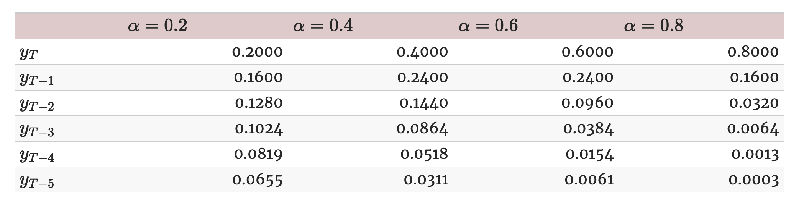

```{r Setup, include = F}
options(htmltools.dir.version = FALSE)
library(pacman)
p_load(broom, latex2exp, ggplot2, ggthemes, ggforce, viridis, dplyr, magrittr, knitr, parallel, xaringanExtra, tidyverse, sjPlot, showtext, mathjaxr, ggforce, furrr, kableExtra, wooldridge, hrbrthemes, scales, ggeasy, patchwork, janitor, tsibble, lubridate, fpp3, MetBrewer)


# Knitr options
opts_chunk$set(
  comment = "#>",
  fig.align = "center",
  fig.height = 8,
  fig.width = 12.5,
  warning = F,
  dev = "svg",
  message = F,
  dpi=300
)

theme_set(theme_ipsum_rc())

```

```{R, colors, include = F}
# Define pink color
red_pink <- "#e64173"
turquoise <- "#20B2AA"
orange <- "#FFA500"
red <- "#E02C05"
blue <- "#2b59c3"
green <- "#0FDA6D"
grey_light <- "grey70"
grey_mid <- "grey50"
grey_dark <- "grey20"
purple <- "#6A5ACD"
```


# Materials

<br><br>

.b[Required readings]:

<br>


  - [`Hyndman & Athanasopoulos, ch. 8`](https://otexts.com/fpp3/expsmooth.html)
  
    - sections 8.1&mdash;8.2.
    


---
class: inverse, middle

# Motivation


---

# Motivation

<br>

After studying benchmark forecasting models and some accuracy measures, it is time to move on to .hi-slate[more interesting] forecasting techniques.

--

<br>

One of them is .hi-red[exponential smoothing].

--

<br>

The key idea behind this method is that it generates forecasts that are .hi-slate[weighted averages] of past observations, with the weights .hi[decaying exponentially] as the observations get *older.*

  - Also, .hi-slate[more recent] observation get *higher* associated weights.


---
class: inverse, middle

# Simple exponential smoothing

---

# Simple exponential smoothing

<br><br>

The starting point when studying exponential smoothing methods is the so-called .hi[Simple Exponential Smoothing] (SES).

--

<br><br>

This method is well-suited for time series with .hi-slate[no] apparent .hi-red[trend] or .hi-blue[seasonal] pattern.


---

# Simple exponential smoothing

```{r, echo=F}

unemp <- read_csv("UNRATE.csv") |> 
  clean_names()

unemp_ts <- unemp |> 
  mutate(date = yearquarter(date)) |> 
  as_tsibble(index = date)

unemp_ts |> 
  autoplot(unrate) +
  labs(title = "U.S. unemployment rate",
       subtitle = "1990Q1—2023Q4",
       caption = "Source: U.S. Bureau of Labor Statistics.",
       y = "Percent") +
  easy_y_axis_title_size(14) +
  easy_plot_caption_size(13)


```


---

# Simple exponential smoothing

The simple exponential smoothing method can be thought of as a .hi[midpoint] between two extremes:

  - The .hi-blue[mean]
  
  - And the .hi-red[naïve] methods.
  
--

Recall that the .hi-blue[mean] method fits the data and predicts future values according to the the .hi-slate[average] of the series.

  - Thus, all observations have the same .hi-red[weight].
  
--

On the other hand, the .hi-red[naïve] method assumes that the .hi-slate[most recent] observation is the *only* important one, and all previous observations provide *no information for the future*.

  - Thus, all the .hi-blue[weight] is given to the *most recent* observation.


---

# Simple exponential smoothing

While these two benchmark methods have their logic, what simple exponential smoothing proposes is a method where .hi[larger weights] are given to .hi-red[most recent] observations, while more distant observations are to the present will be given .hi[less importance].

--

This way, the model is fitted to the data and forecasts are produced using .hi-blue[weighted averages], where the weights decrease *exponentially* as observations come from further in the past (i.e., the *smallest weights* are associated with the *oldest* observations).

--

More formally,

<br>

$$
\begin{aligned}
\hat{y}_{T+1|T} = \alpha y_T + \alpha(1-\alpha)y_{T-1} + \alpha(1-\alpha)^2y_{T-2} + \cdot \cdot \cdot
\end{aligned}
$$

--

<br>

where *&alpha;* is called the .hi-red[smoothing parameter], lying between 0 and 1.


---

# Simple exponential smoothing

.center[

]

--

<br>


- The smaller *&alpha;* is, more weight is given to observations from the *more distant past*.

--

- The larger *&alpha;* is, more weight is given to the *more recent observations*.

--

- What happens when *&alpha; = 1*?


---

# Simple exponential smoothing

Each exponential smoothing method we will study can be represented by what we call its .hi-blue[component form].

--

A method's component form comprises a set of .hi-red[equations] illustrating the relevant components of the model.

--

In the case of .hi[simple exponential smoothing], the component form has .hi-red[two pieces]:

--

<br>

$$
\begin{aligned}
\text{Forecast equation:} \ \  \hat{y}_{t+h|t} = \ell_t
\end{aligned}
$$

$$
\begin{aligned}
\text{Smoothing equation:} \ \ \ell_t = \alpha y_t + (1-\alpha)\ell_{t-1}
\end{aligned}
$$

<br>

where $\ell_t$ is the .hi-slate[level] (or the smoothed value) of the series at time *t*.

---

# Simple exponential smoothing

Illustrating the .hi-blue[smoothing equation]:

```{r, echo=F, fig.height=7}

unemp_ets_fit <- unemp_ts |> 
  model(SES = ETS(unrate ~ error("A") + trend("N") + season("N")))

unemp_ets_fit |> 
  augment() |> 
  ggplot(aes(x = date, y = unrate)) +
  geom_line(aes(color = "Original series")) +
  geom_line(aes(y = .fitted, color = "Fitted values (SES)"), linewidth = .8) +
  scale_color_manual(values = c("#28935c", "#890c0a")) +
  easy_y_axis_title_size(14) +
  easy_legend_at("top") +
  easy_plot_legend_size(13) +
  labs(y = "Unemployment rate",
       color = "",
       x = "")


```


---

# Simple exponential smoothing


```{r}
unemp_ets_fit <- unemp_ts |> 
  model(SES = ETS(unrate ~ error("A") + trend("N") + season("N"))) # "A" = additive; "N" = none.


unemp_ets_fit |> 
  augment()

```


---

# Simple exponential smoothing


```{r, highlight.output = 5}
unemp_ets_fit <- unemp_ts |> 
  model(SES = ETS(unrate ~ error("A") + trend("N") + season("N"))) # "A" = additive; "N" = none.


unemp_ets_fit |> 
  augment() 
```


---

# Simple exponential smoothing

In order to .hi-blue[fit] an exponential smoothing model, we need to define .hi-red[two values]:

  - the smoothing parameter *&alpha;*;
  
  - The .hi-slate[initial value] for the level term $\ell$, $\ell_0$.

--

While these can be arbitrarily chosen, a better method is to obtain these by .hi-red[minimizing] the Sum of Squared Residuals (SSR):


$$
\begin{aligned}
\text{SSR} = \displaystyle\sum_{t=1}^{T}(y_t - \hat{y}_{t|t-1})^2 = \displaystyle\sum_{t=1}^{T}e_t^2
\end{aligned}
$$

--

<br>

Different from a .hi-blue[linear regression] context, this method involves a non-linear optimization, which requires .hi-slate[computational methods] for its solution.


---

# Simple exponential smoothing

.pull-left[
```{r}

unemp_ets_fit |> 
  report()

```
]
--

.pull-right[
```{r, highlight.output=5}
unemp_ets_fit |> 
  augment() |> 
  head(7)
```
]

---

# Simple exponential smoothing

After the model has been fit, forecasts can be produced.

--

Simple exponential smoothing delivers .hi-slate[flat] forecasts.

--

In other words, all forecasts take the .hi-red[same value], equal to the last level component.

--

<br><br>

This should *make sense*, since it assumes .hi-blue[no trend] and .hi-blue[no seasonality].


---

# Simple exponential smoothing

```{r, echo=F}
unemp_ets_fc |> 
  autoplot(unemp_ts, color = "#28935c", linewidth = 0.8) +
  geom_line(aes(y = .fitted), color = "#890c0a",
            data = augment(unemp_ets_fit)) +
  easy_y_axis_title_size(14) +
  labs(y = "Unemployment rate",
       color = "",
       x = "", 
       title = "8-quarter ahead forecast")
```


---
class: inverse, middle

# Exponential smoothing with trend


---

# Exponential smoothing with trend

The simple exponential smoothing method is a good .hi-red[starting point] when learning this technique.

--

But usually we deal with series that show a .hi[trend] over time.

--

Thus, we need to further .hi-blue[build up] from this baseline method in order to incorporate other .hi[features] the time series may have.

--

When considering the existence of a .hi[trend], the .hi-slate[component form] of exponential smoothing becomes:


<br>

$$
\begin{aligned}
\text{Forecast equation:} \ \  \hat{y}_{t+h|t} = \ell_t + hb_t
\end{aligned}
$$

$$
\begin{aligned}
\text{Level equation:} \ \ \ell_t = \alpha y_t + (1-\alpha)(\ell_{t-1} + b_{t-1})
\end{aligned}
$$

$$
\begin{aligned}
\text{Trend equation:} \ \ b_t = \beta^*(\ell_t - \ell_{t-1}) + (1-\beta^*)b_{t-1}
\end{aligned}
$$

---

# Exponential smoothing with trend

$$
\begin{aligned}
\text{Forecast equation:} \ \  \hat{y}_{t+h|t} = \ell_t + hb_t
\end{aligned}
$$

$$
\begin{aligned}
\text{Level equation:} \ \ \ell_t = \alpha y_t + (1-\alpha)(\ell_{t-1} + b_{t-1})
\end{aligned}
$$

$$
\begin{aligned}
\text{Trend equation:} \ \ b_t = \beta^*(\ell_t - \ell_{t-1}) + (1-\beta^*)b_{t-1}
\end{aligned}
$$

<br>

A few new terms:

  - $b_t$ denotes an estimate of the trend (slope) of the series at time *t*;
  
  - $\beta^*$ is the smoothing parameter for the trend (just like $\alpha$ is for the level).
  
  
--

Now, forecasts are .hi-red[no longer flat].

--

The *h*-step-ahead forecast is equal to the *last* estimated .hi-blue[level] plus *h* times the *last* estimated .hi-blue[trend] value.

---

# Exponential smoothing with trend


```{r, echo=F}

cpi <- read_csv("CPIAUCSL.csv") |> 
  clean_names() |> 
  rename(cpi = cpiaucsl)


cpi_ts <- cpi |> 
  mutate(date = yearmonth(date)) |> 
  as_tsibble(index = date)


cpi_ts |> 
  autoplot() +
  labs(title = "U.S. Consumer Price Index (CPI)",
                  subtitle = "01/2000—01/2024",
                  caption = "Source: U.S. Bureau of Labor Statistics.",
                  y = "Index 1982-1984 = 100") +
  easy_y_axis_title_size(14) +
  easy_plot_caption_size(13)

```


---

# Exponential smoothing with trend

.pull-left[
```{r}
cpi_ets_trend_fit <- cpi_ts |> 
  model(ETS_Trend = ETS(cpi ~ error("A") + 
                          trend("A") + 
                          season("N")))

cpi_ets_trend_fit |> 
  augment() |> 
  head(5)
```
]

.pull-right[
```{r}
cpi_ets_trend_fit |> 
  report()
```

]


---

# Exponential smoothing with trend

```{r, echo=F}
cpi_ets_trend_fit <- cpi_ts |> 
  model(ETS_Trend = ETS(cpi ~ error("A") + trend("A") + season("N")))

cpi_ets_trend_fit |> 
  augment() |> 
  ggplot(aes(x = date, y = cpi)) +
  geom_line(aes(color = "Original series")) +
  geom_line(aes(y = .fitted, color = "Fitted values (ETS with trend)"), linewidth = .8) +
  scale_color_manual(values = c("#28935c", "#890c0a")) +
  easy_y_axis_title_size(14) +
  easy_legend_at("top") +
  easy_plot_legend_size(13) +
  labs(y = "CPI",
       color = "",
       x = "")


```


---

# Exponential smoothing with trend

```{r, echo=F}
cpi_ets_trend_fc <- cpi_ets_trend_fit |> 
  forecast(h = 12)


cpi_ets_trend_fc |> 
  autoplot(cpi_ts, color = "#28935c", linewidth = 0.8) +
  geom_line(aes(y = .fitted), color = "#890c0a",
            data = augment(cpi_ets_trend_fit)) +
  easy_y_axis_title_size(14) +
  labs(y = "CPI",
       color = "",
       x = "",
       title = "12-month ahead forecast")
```


---
class: inverse, middle

# Damped trend methods


---

# Damped trend methods

The previous method produces forecasts with a .hi-slate[constant trend] that either increases or decreases .hi-red[indefinitely] into the future.

--

Many times, especially for longer forecast horizons, that may be .hi-slate[too extreme].

--

Thus, there are methods that can "*dampen*" the trend to a flat line over longer forecast horizons.

--

Now our .hi-slate[component form] includes a .hi-red[damping parameter], $\phi$:

--

$$
\begin{aligned}
\text{Forecast equation:} \ \  \hat{y}_{t+h|t} = \ell_t + (\phi + \phi^2 + \cdot \cdot \cdot + \phi^h)b_t
\end{aligned}
$$

$$
\begin{aligned}
\text{Level equation:} \ \ \ell_t = \alpha y_t + (1-\alpha)(\ell_{t-1} + \phi b_{t-1})
\end{aligned}
$$

$$
\begin{aligned}
\text{Trend equation:} \ \ b_t = \beta^*(\ell_t - \ell_{t-1}) + (1-\beta^*)\phi b_{t-1}
\end{aligned}
$$

<br>

If $\phi=1$, we are back to the previous trend method.


---

# Damped trend methods

```{r}
cpi_ets_trend_damped_fit <- cpi_ts |> 
  model(ETS_Trend_Damped = ETS(cpi ~ error("A") + trend("Ad") + season("N")))


```

--


.pull-left[
```{r}
cpi_ets_trend_damped_fit |> 
  augment() |> 
  head(5)
```
]


.pull-right[
```{r}
cpi_ets_trend_damped_fit |> 
  report()
```

]

---

# Damped trend methods

```{r, echo=F}
cpi_ets_trend_damped_fc <- cpi_ets_trend_damped_fit |> 
  forecast(h = 36)

cpi_ets_trend_damped_fc |> 
  autoplot(cpi_ts, color = "#28935c", linewidth = 0.8) +
  geom_line(aes(y = .fitted), color = "#890c0a",
            data = augment(cpi_ets_trend_damped_fit)) +
  easy_y_axis_title_size(14) +
  labs(y = "CPI",
       color = "",
       x = "",
       title = "36-month ahead forecast")
```


---

# All together...

```{r}
cpi_train <- cpi_ts |> 
  filter_index(. ~ "2021-12-01")

cpi_ets_models <- cpi_train |> 
  model(SES = ETS(cpi ~ error("A") + trend("N") + season("N")),
        ETS_trend = ETS(cpi ~ error("A") + trend("A") + season("N")),
        ETS_Damped_trend = ETS(cpi ~ error("A") + trend("Ad") + season("N")))

cpi_models_fc <- cpi_ets_models |> 
  forecast(h = 25)

```


---

# All together...


```{r, echo=F}

cpi_models_fc |> 
  autoplot(cpi_ts, linewidth = 0.9) +
  easy_y_axis_title_size(14) +
  labs(y = "CPI",
       x = "",
       title = "3 different ETS models") +
  easy_plot_legend_size(13)
```

---

# All together...


```{r}
cpi_models_fc |> 
  accuracy(cpi_ts) |> 
  select(.model, MAE, RMSE, MAPE, MASE)
```


---
layout: false
class: inverse, middle

# Next time: More exponential smoothing models

---
exclude: true


