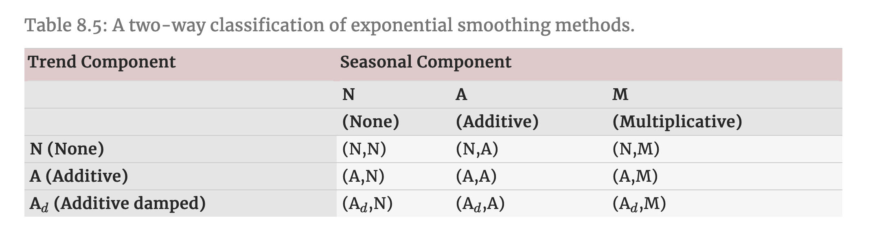

```{r Setup, include = F}
options(htmltools.dir.version = FALSE)
library(pacman)
p_load(broom, latex2exp, ggplot2, ggthemes, ggforce, viridis, dplyr, magrittr, knitr, parallel, xaringanExtra, tidyverse, sjPlot, showtext, mathjaxr, ggforce, furrr, kableExtra, wooldridge, hrbrthemes, scales, ggeasy, patchwork, janitor, tsibble, lubridate, fpp3, MetBrewer)


# Knitr options
opts_chunk$set(
  comment = "#>",
  fig.align = "center",
  fig.height = 8,
  fig.width = 12.5,
  warning = F,
  dev = "svg",
  message = F,
  dpi=300
)

theme_set(theme_ipsum_rc())

```

```{R, colors, include = F}
# Define pink color
red_pink <- "#e64173"
turquoise <- "#20B2AA"
orange <- "#FFA500"
red <- "#E02C05"
blue <- "#2b59c3"
green <- "#0FDA6D"
grey_light <- "grey70"
grey_mid <- "grey50"
grey_dark <- "grey20"
purple <- "#6A5ACD"
```


# Materials

<br><br>

.b[Required readings]:

<br>


  - [`Hyndman & Athanasopoulos, ch. 8`](https://otexts.com/fpp3/holt-winters.html)
  
    - sections 8.3&mdash;8.7.
    


---
class: inverse, middle

# Motivation


---

# Motivation

<br>


Last time, we were introduced to .hi-red[exponential smoothing].

--

<br>

Recall that its .hi[main idea] comprises using .hi-blue[weighted averages], balancing out the *relative importance* of more recent and older observations.

--

<br>

Now, we move on by incorporating .hi-slate[seasonality] into exponential smoothing methods.


---
class: inverse, middle

# Exponential smoothing with seasonality


---

# Exponential smoothing with seasonality

As we are trying to incorporate more .hi-red[features] into our models, exponential smoothing methods have to include additional .hi-blue[parameters] and .hi-slate[equations].

--

There are .hi-red[two variations] to this method that differ in the .hi-slate[nature] of the seasonal component:

  - The *additive*;
  
  - And the *multiplicative* methods.


--

<br>


The .hi-red[additive] method is preferred when the seasonal variations are .hi-blue[roughly constant] through the series.

--

The .hi-blue[multiplicative] method is preferred when the seasonal variations are .hi-slate[changing] proportional to the level of the series.


---

# Exponential smoothing with seasonality

Let us start with the .hi[additive] method.

--

The .hi-slate[component form] looks like the following:

<br>


$$
\begin{aligned}
\text{Forecast equation:} \ \  \hat{y}_{t+h|t} = \ell_t + hb_t + s_{t+h-m(k+1)}
\end{aligned}
$$

$$
\begin{aligned}
\text{Level equation:} \ \ \ell_t = \alpha (y_t - s_{t-m}) + (1-\alpha)(\ell_{t-1} + b_{t-1})
\end{aligned}
$$

$$
\begin{aligned}
\text{Trend equation:} \ \ b_t = \beta^*(\ell_t - \ell_{t-1}) + (1-\beta^*) b_{t-1}
\end{aligned}
$$
$$
\begin{aligned}
\text{Seasonal equation:} \ \ s_t = \gamma(y_t - \ell_{t-1} - b_{t-1}) + (1-\gamma)s_{t-m}
\end{aligned}
$$

<br><br>

where *m* denotes the period of seasonality.

---

# Exponential smoothing with seasonality

Then, for .hi-slate[multiplicative] seasonality, we have:

<br><br>


$$
\begin{aligned}
\text{Forecast equation:} \ \  \hat{y}_{t+h|t} = (\ell_t + hb_t)s_{t+h-m(k+1)}
\end{aligned}
$$

$$
\begin{aligned}
\text{Level equation:} \ \ \ell_t = \alpha \dfrac{y_t}{s_{t-m}} + (1-\alpha)(\ell_{t-1} + b_{t-1})
\end{aligned}
$$

$$
\begin{aligned}
\text{Trend equation:} \ \ b_t = \beta^*(\ell_t - \ell_{t-1}) + (1-\beta^*) b_{t-1}
\end{aligned}
$$

$$
\begin{aligned}
\text{Seasonal equation:} \ \ s_t = \gamma \dfrac{y_t}{(\ell_{t-1} + b_{t-1})} + (1-\gamma)s_{t-m}
\end{aligned}
$$


---

# Exponential smoothing with seasonality


<br><br><br>

Regardless of the method, we may also allow for a .hi[damped trend], as we have seen in the previous lecture.


---
class: inverse, middle

# An example

---

# An example

```{r, echo=F}

air <- read_csv("air_passengers.csv")


air_ts <- air |> 
  mutate(date = yearmonth(date)) |> 
  as_tsibble(index = date)


air_ts |> 
  ggplot(aes(x = date, y = passengers)) +
  geom_line() +
  labs(title = "International airline passengers",
       subtitle = "Jan 1949 – Dec 1960",
       caption = "Source: Brown (1962).",
       x = "",
       y = "Thousands") +
  easy_y_axis_title_size(14) +
  easy_plot_caption_size(14)


```


---

# An example


```{r}
air_season_A_fit <- air_ts |> 
  model(additive_method = ETS(passengers ~ error("A") + trend("A") + season("A")))

air_season_A_fit |> 
  report()
```


---

# An example

```{r, echo=F}

air_season_A_fit |> 
augment() |> 
  ggplot(aes(x = date, y = passengers)) +
  geom_line(aes(color = "Original series")) +
  geom_line(aes(y = .fitted, color = "Fitted values (ETS with trend + additive seasonality)"), linewidth = .8) +
  scale_color_manual(values = c("#28935c", "#890c0a")) +
  easy_y_axis_title_size(14) +
  easy_legend_at("top") +
  easy_plot_legend_size(13) +
  labs(y = "Passengers",
       color = "",
       x = "")


```

---

# An example


```{r}
air_season_M_fit <- air_ts |> 
  model(additive_method = ETS(passengers ~ error("M") + trend("A") + season("M")))

air_season_M_fit |> 
  report()
```


---

# An example

```{r, echo=F}

air_season_M_fit |> 
augment() |> 
  ggplot(aes(x = date, y = passengers)) +
  geom_line(aes(color = "Original series")) +
  geom_line(aes(y = .fitted, color = "Fitted values (ETS with trend + additive seasonality)"), linewidth = .8) +
  scale_color_manual(values = c("#28935c", "#890c0a")) +
  easy_y_axis_title_size(14) +
  easy_legend_at("top") +
  easy_plot_legend_size(13) +
  labs(y = "Passengers",
       color = "",
       x = "")


```


---

# An example

```{r}
air_season_A_fc <- air_season_A_fit |> 
  forecast(h = 24)

air_season_M_fc <- air_season_M_fit |> 
  forecast(h = 24)
```


---

# An example

```{r, echo=F}
air_season_A_fc |> 
  autoplot(air_ts, color = "#d62b5b", linewidth = 0.8) +
  geom_line(aes(y = .fitted), color = "#890c0a", linewidth = 0.8,
            data = augment(air_season_A_fit)) +
  easy_y_axis_title_size(14) +
  easy_legend_at("top") +
  labs(y = "Air passengers (thousands)",
       color = "",
       x = "", 
       title = "24-month ahead forecast (additive method)")
```


---

# An example

```{r, echo=F}

air_season_M_fc |> 
  autoplot(air_ts, color = "#d62b5b", linewidth = 0.8) +
  geom_line(aes(y = .fitted), color = "#890c0a", linewidth = 0.8,
            data = augment(air_season_M_fit)) +
  easy_y_axis_title_size(14) +
  easy_legend_at("top") +
  labs(y = "Air passengers (thousands)",
       color = "",
       x = "", 
       title = "24-month ahead forecast (multiplicative method)")

```


---
class: inverse, middle

# ETS taxonomy

---

# ETS taxonomy

As you may have noticed, different .hi-red[variations] of exponential smoothing are possible.

--

It all *depends on* the features we would like to explore from our data, and also whether these features (especially .hi-red[seasonality]) behaves in a *constant* or *non-constant* way.

--

Thus, it is possible to develop a .hi-blue[taxonomy] of exponential smoothing methods:

.center[

]


--

The textbook also includes all *mathematical expressions* for each model's .hi-slate[component form].

---
class: inverse, middle

# Further thoughts

---

# Further thoughts

The exponential smoothing methods we have studied so far only produce .hi-blue[point forecasts].

--

The main issue concerning this fact is that these methods do not deliver .hi-red[prediction intervals].

--

This way, exponential smoothing .hi-slate[methods] are not the same as .hi[statistical models].


--

<br>

> *A statistical model is a stochastic (or random) data generating process that can produce an entire forecast distribution.*

---

# Further thoughts

Given that we need a .hi-red[forecast distribution] in order to produce a .hi-slate[full forecast], we need to specify the .hi[stochastic] part of our methods.

--

Recall, from a few lectures ago, our definition of .hi-red[forecast errors]:

--

<br>

> A .hi-red[forecast error] is the difference between an *observed* value and its *forecast*.

---

# Further thoughts

<br>

Formally, 

$$
\begin{aligned}
e_{T+h} = y_{T+h} - \hat{y}_{T+h \ |\ T}
\end{aligned}
$$

--

<br>

Coming back to .hi-slate[Simple Exponential Smoothing] (SES) methods, we can turn the component form into a statistical model:

$$
\begin{aligned}
y_t = \ell_{t-1} + \varepsilon_t
\end{aligned}
$$

$$
\begin{aligned}
\ell_t = \ell_{t-1} + \alpha \varepsilon_t
\end{aligned}
$$

where $\varepsilon_t \sim \mathcal{N}(0, \sigma^2)$.


--


The same "*error correction*" approach can be adopted for the other exponential smoothing methods.


---
class: inverse, middle

# Model selection

---

# Model selection

Models estimated via exponential smoothing have .hi-blue[36 possible variations], depending on how we specify its .b[E]rror, .b[T]rend, and .b[S]easonal components.

--

  - *But which one should we choose*?


--

A good .hi-red[starting point] is estimating the simplest possible model, accounting for the presence of .hi-slate[each feature] (or lack thereof).


---

# Model selection


```{r, echo=F}

air_ts |> 
  ggplot(aes(x = date, y = passengers)) +
  geom_line() +
  labs(title = "International airline passengers",
       subtitle = "Jan 1949 – Dec 1960",
       caption = "Source: Brown (1962).",
       x = "",
       y = "Thousands") +
  easy_y_axis_title_size(14) +
  easy_plot_caption_size(14)


```

---
class: clear


```{r, fig.height = 7.5}
air_season_A_fit |> 
  components() |> 
  autoplot()
```


---
class: clear


```{r, fig.height = 7.5}
air_season_M_fit |> 
  components() |> 
  autoplot()
```


---

# Model selection

<br>

When errors are of a .hi-red[multiplicative] nature, simply minimizing the squared residuals is not sufficient for for model esimation.

--

Thus, a better approach is .hi[Maximum Likelihood] (ML).

--

<br>

Maximum Likelihood implies that, given the model we have chosen, what is the probability of obtaining the data we observe (*y<sub>t</sub>*)?

--

  - Thus, a *large likelihood* is associated with a *good model*. 
  
---

# Model selection

Based on Maximum Likelihood, ETS models can make use of so-called .hi-slate[information criteria] for model comparison and selection.

--

One of them is the .hi-red[Akaike Information Criterion (AIC):]

$$
\begin{aligned}
\text{AIC} = -2 \text{log}(L) + 2k
\end{aligned}
$$

--

where *L* is the likelihood of the model and *k* is the total number of *parameters* and *initial states* that have been estimated (including the residual variance).

--

<br>

For smaller samples, an alternative measure is the .hi-slate[corrected AIC (AIC<sub>c</sub>)]:

$$
\begin{aligned}
\text{AIC}_{\text{c}} = \text{AIC} + \dfrac{2k(k+1)}{T-k-1}
\end{aligned}
$$

---

# Model selection

Out of the 36 possible variations of ETS models, three of them usually produce .hi-slate[numerically unstable] estimations:

  1. ETS(A, N, M);
  2. ETS(A, A, M);
  3. ETS(A, A<sub>d</sub>, M).
  
  
--

<br>

Therefore, the above models are hardly used in practice.

--

Models with .hi-blue[multiplicative errors] are useful when the data are .hi-red[strictly positive], but are .hi-slate[not] numerically stable when the data contain *zeros* or *negative values*. 

---

# Model selection

.pull-left[
```{r}

air_season_A_fit |> 
  report()
```
]

.pull-right[
```{r}
air_season_M_fit |> 
  report()
```

]


---

# Model selection

Fortunately for us, the `ETS()` function will deliver the model specification that .hi-blue[minimizes] the .hi-red[corrected AIC].

  - Of course, when we do not specify a model ourselves.
  

--

<br>

```{r, highlight.output = 4}
air_pass_ets <- air_ts |> 
  model(ETS_best_model = ETS(passengers))

air_pass_ets

```

---

# Model selection

```{r, echo=F}
air_pass_ets_fc <- air_pass_ets |> 
  forecast(h = 24)


air_pass_ets_fc |> 
  autoplot(air_ts, linewidth = .9, level = 95) +
  easy_y_axis_title_size(14) +
  easy_legend_at("top") +
  easy_plot_legend_size(13) +
  labs(y = "Air passengers (thousands)",
       color = "",
       x = "", 
       title = "24-month ahead forecast (fable selection)")

```


---

# Model selection

```{r, echo=F}

air_pass_ets_fc |> 
  autoplot(air_ts, color = "#28935c", linewidth = 0.8, level = 95) +
  geom_line(aes(y = .fitted), color = "#890c0a", linewidth = 0.8,
            data = augment(air_pass_ets)) +
  easy_y_axis_title_size(14) +
  labs(y = "Passengers",
       color = "",
       x = "")

```


---
layout: false
class: inverse, middle

# Next time: ARIMA models

---
exclude: true


