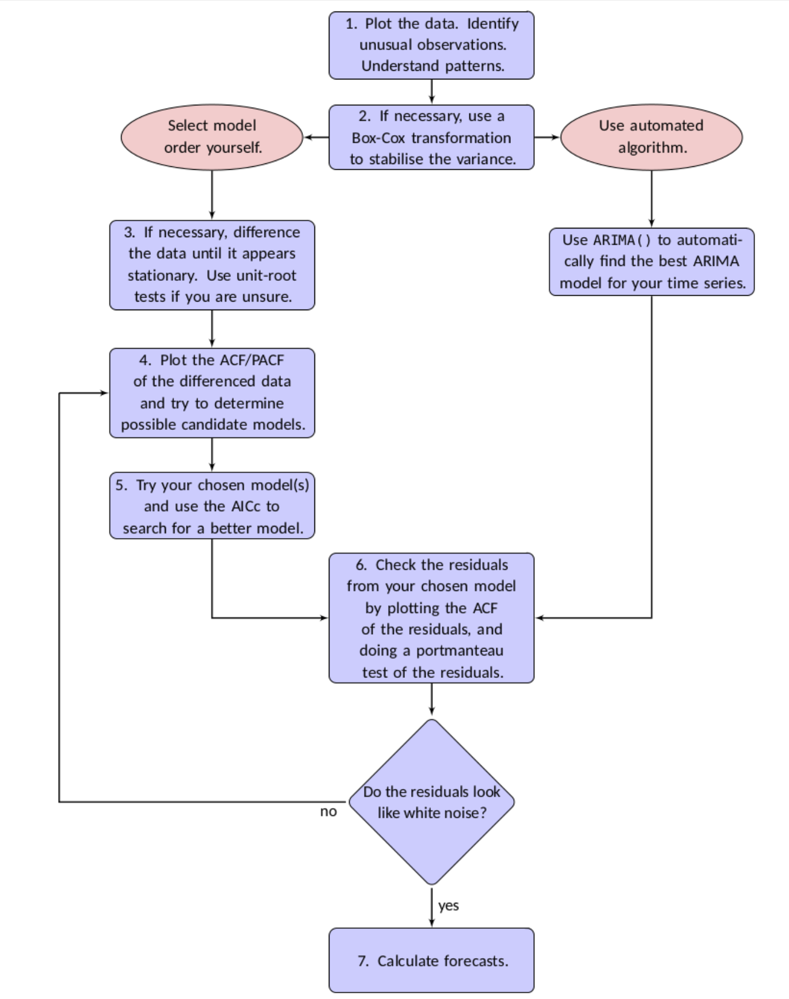

```{r Setup, include = F}
options(htmltools.dir.version = FALSE)
library(pacman)
p_load(broom, latex2exp, ggplot2, ggthemes, ggforce, viridis, dplyr, magrittr, knitr, parallel, xaringanExtra, tidyverse, sjPlot, showtext, mathjaxr, ggforce, furrr, kableExtra, wooldridge, hrbrthemes, scales, ggeasy, patchwork, janitor, tsibble, lubridate, fpp3, MetBrewer)


# Knitr options
opts_chunk$set(
  comment = "#>",
  fig.align = "center",
  fig.height = 8,
  fig.width = 12.5,
  warning = F,
  dev = "svg",
  message = F,
  dpi=300
)

theme_set(theme_ipsum_rc())

```

```{R, colors, include = F}
# Define pink color
red_pink <- "#e64173"
turquoise <- "#20B2AA"
orange <- "#FFA500"
red <- "#E02C05"
blue <- "#2b59c3"
green <- "#0FDA6D"
grey_light <- "grey70"
grey_mid <- "grey50"
grey_dark <- "grey20"
purple <- "#6A5ACD"
```


# Materials

<br><br>

.b[Required readings]:

<br>


  - [`Hyndman & Athanasopoulos, ch. 9`](https://otexts.com/fpp3/arima-r.html)
  
    - sections 9.7&mdash;9.8.
    


---
class: inverse, middle

# Motivation


---

# Motivation

<br>

Last time, we have joined the *AR*, *I*, and *MA* portions of .hi-slate[ARIMA] models.

--

When deciding on the .hi-red[order] of our ARIMA models, a great starting point is to look at the *autocorrelation coefficient function* (.hi-blue[ACF]) and *partial autocorrelation function* (.hi-blue[PACF]) plots.

--

<br>

However, these can only do .hi-slate[so much] when deciding on which model to choose and perform our forecasts.

--

Therefore, we must move on to more .hi-slate[robust] procedures.


---
class: inverse, middle

# ARIMA at work


---

# ARIMA at work

The `{fable}` R package handles ARIMA estimation following the .hi-slate[Hyndman-Khandakar algorithm]:

--

.center[

]


---

# ARIMA at work

The .hi-red[stepwise] procedure:

.center[

]


---

# ARIMA at work

The .hi-red[stepwise] procedure:

.center[

]

---

# ARIMA at work

The .hi-red[stepwise] procedure:

.center[

]


---
class: clear


.center[

]

---
class: inverse, middle

# An example


---

# An example

```{r, echo=F}
saving <- read_csv("PSAVERT.csv") |> 
  clean_names() |> 
  rename(psav = psavert)

saving_ts <- saving |> 
  mutate(date = year(date),
         psav = as.double(psav)) |> 
  as_tsibble(index = date) |> 
  filter_index(. ~ "2023")

saving_ts |> 
  autoplot() +
  labs(title = "U.S. personal saving rate",
       y = "Percent",
       subtitle = "1959–2023",
       caption = "Source: U.S. Bureau of Economic Analysis.") +
  easy_y_axis_title_size(13) +
  easy_plot_caption_size(13)
```


---

# An example

```{r}
saving_ts |> 
  features(psav, unitroot_kpss)
```


```{r}
saving_ts |> 
  features(difference(psav), unitroot_kpss)
```

---

# An example

.pull-left[
```{r, echo=F, fig.width = 9, fig.height = 7}
saving_ts |> 
  ACF() |> 
  autoplot() +
  labs(title = "ACF plot",
       y = "ACF") +
easy_y_axis_title_size(15)
```

]

.pull-right[

```{r, echo=F, fig.width = 9, fig.height = 7}

saving_ts |> 
  PACF() |> 
  autoplot() +
  labs(title = "PACF plot",
       y = "PACF") +
  easy_y_axis_title_size(15)
```

]


---

# An example

```{r}
saving_arima_fit <- saving_ts |> 
  model(arima310 = ARIMA(psav ~ 1 + pdq(3, 1, 0)), # "1" includes a constant (c).
        arima113 = ARIMA(psav ~ 1 + pdq(1, 1, 3)), # "1" includes a constant (c).
        arima_auto = ARIMA(psav)) # letting {fable} select the best model.

saving_arima_fit
```


---

# An example

```{r}
saving_arima_fit |> 
  glance() |> 
  arrange(AICc) |> 
  select(.model, AIC, AICc)

```


---
class: clear


```{r, fig.height = 7}
saving_arima_fit |> 
  select(arima310) |> 
  gg_tsresiduals()
```


---

# An example

```{r}
saving_arima_fit |> 
  augment() |> 
  filter(.model == "arima310") |> 
  features(.innov, ljung_box, lag = 10, dof = 3)
```


---
class: clear


```{r, fig.height = 7}
saving_arima_fit |> 
  select(arima113) |> 
  gg_tsresiduals()
```

---

# An example

```{r}
saving_arima_fit |> 
  augment() |> 
  filter(.model == "arima113") |> 
  features(.innov, ljung_box, lag = 10, dof = 4)
```


---
class: clear


```{r, fig.height = 7}
saving_arima_fit |> 
  select(arima_auto) |> 
  gg_tsresiduals()
```


---

# An example

```{r}
saving_arima_fit |> 
  augment() |> 
  filter(.model == "arima_auto") |> 
  features(.innov, ljung_box, lag = 10, dof = 2)
```


---
class: inverse, middle

# Forecasting with ARIMA


---

# Forecasting with ARIMA

Time to explain .hi-red[how] ARIMA forecasts are generated.

--

Suppose our model of choice is an .hi-blue[ARMA(2, 2)].

<br>

$$
\begin{aligned}
y_t = c + \phi_1y_{t-1} + \phi_2y_{t-2} + \theta_1\varepsilon_{t-1} + \theta_2\varepsilon_{t-2} + \varepsilon_t
\end{aligned}
$$

<br>

--

Let us derive the .hi-slate[point forecasts] for *T + 1* and *T + 2*:

---

# Forecasting with ARIMA

Coming back to our example...

<br>

```{r}
saving_arima_fc <- saving_arima_fit |> 
  forecast(h = 6)
```


---

# Forecasting with ARIMA


```{r, echo=F}
saving_arima_fc |> 
  filter(.model == "arima310") |> 
  autoplot(saving_ts, level = 95) +
  labs(title = "6-year ahead forecast: ARIMA(3, 1, 0) model",
       subtitle = "U.S. personal saving rate",
       y = "Percent",
       x = "") +
  easy_y_axis_title_size(13)
```

---

# Forecasting with ARIMA


```{r, echo=F}
saving_arima_fc |> 
  filter(.model == "arima113") |> 
  autoplot(saving_ts, level = 95) +
  labs(title = "6-year ahead forecast: ARIMA(1, 1, 3) model",
       subtitle = "U.S. personal saving rate",
       y = "Percent",
       x = "") +
  easy_y_axis_title_size(13)
```


---

# Forecasting with ARIMA


```{r, echo=F}
saving_arima_fc |> 
  filter(.model == "arima_auto") |> 
  autoplot(saving_ts, level = 95) +
  labs(title = "6-year ahead forecast: ARIMA(0, 1, 2) model",
       subtitle = "U.S. personal saving rate",
       y = "Percent",
       x = "") +
  easy_y_axis_title_size(13)
```


---
layout: false
class: inverse, middle

# Next time: Seasonal ARIMA models

---
exclude: true


