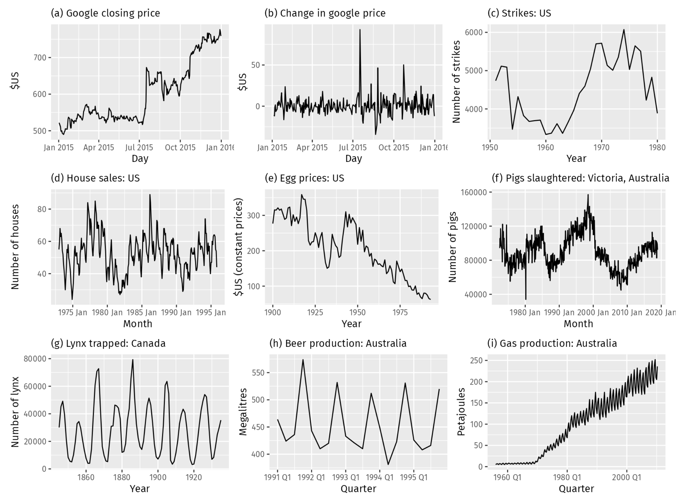

```{r Setup, include = F}
options(htmltools.dir.version = FALSE)
library(pacman)
p_load(broom, latex2exp, ggplot2, ggthemes, ggforce, viridis, dplyr, magrittr, knitr, parallel, xaringanExtra, tidyverse, sjPlot, showtext, mathjaxr, ggforce, furrr, kableExtra, wooldridge, hrbrthemes, scales, ggeasy, patchwork, janitor, tsibble, lubridate, fpp3, MetBrewer)


# Knitr options
opts_chunk$set(
  comment = "#>",
  fig.align = "center",
  fig.height = 8,
  fig.width = 12.5,
  warning = F,
  dev = "svg",
  message = F,
  dpi=300
)

theme_set(theme_ipsum_rc())

```

```{R, colors, include = F}
# Define pink color
red_pink <- "#e64173"
turquoise <- "#20B2AA"
orange <- "#FFA500"
red <- "#E02C05"
blue <- "#2b59c3"
green <- "#0FDA6D"
grey_light <- "grey70"
grey_mid <- "grey50"
grey_dark <- "grey20"
purple <- "#6A5ACD"
```


# Materials

<br><br>

.b[Required readings]:

<br>


  - [`Hyndman & Athanasopoulos, ch. 9`](https://otexts.com/fpp3/arima.html)
  
    - sections 9.1&mdash;9.4.
    


---
class: inverse, middle

# Motivation


---

# Motivation

<br>


Along with *exponential smoothing*, .hi-red[ARIMA models] are the most .hi[widely used] approach for time series forecasting.

--

<br>

That said, these two techniques should not be seen as .hi-red[competing], but as .hi-blue[complementary] to each other.

--

<br>

One .hi-slate[key distinction] between these two approaches is that, while exponential smoothing focuses on time series .hi[features] (*error*, *trend*, and *seasonality*), ARIMA models focus on the presence of .hi-red[autocorrelation] in the data.

--


We will start studying ARIMA models by looking at time series .hi-blue[stationarity].


---
class: inverse, middle

# Stationarity


---

# Stationarity

In short:

> *A .hi-red[stationary] time series is one whose statistical properties .hi-blue[do not] depend on the time at which the series is observed.*

--

<br>

In other words, a time series that contains relevant features&mdash;such as *trend* and *seasonality*&mdash;will not be .hi-red[stationary], since its behavior changes over time.

--

On the other hand, a time series following a .hi-slate[white noise] process is stationary.

  - Whenever you observe the series, it will look pretty much the same.
  
--


In .hi[visual] terms, the *time plot* of a stationary time series will be roughly .hi-red[horizontal] (which can include *cyclic* behavior) and with a *constant variance*.

---

# Stationarity

.center[

]


---

# Stationarity

Recall that one .hi-slate[key] characteristic of a stationary time series is .hi-red[constant variance].

--

A few weeks ago, we learned that .hi-orange[log-transformations] help to stabilize a series' variance over time.

--

But in order for a time series to be stationary, its .hi-blue[mean] should also be stable over time (i.e., with no trend).

--

A technique that helps to stabilize the .hi-blue[mean] of a time series is known as .hi-slate[differencing].

--

<br>

A .hi-red[differenced series] is the *change between consecutive observations* in the original series, and can be written as 


$$
\begin{aligned}
y_t' = y_t - y_{t-1}
\end{aligned}
$$

---

# Stationarity

When the differenced series is .hi-slate[white noise], the model for the original series can be written as:

$$
\begin{aligned}
y_t - y_{t-1} = \varepsilon_t
\end{aligned}
$$

where $\varepsilon_t$ denotes a white noise process (i.e., with no autocorrelation).

--

<br>

*Rearranging* the above equation, we end up with

$$
\begin{aligned}
y_t = y_{t-1} + \varepsilon_t
\end{aligned}
$$

<br>

which, unsurprisingly, is a .hi-red[random walk process].


---

# Stationarity

<br>

$$
\begin{aligned}
y_t = y_{t-1} + \varepsilon_t
\end{aligned}
$$

<br>

*Random walk* models are widely used for .hi[non-stationary] data, as they typically show:

  - long periods of apparent *trends* up or down;
  - *sudden* and *unpredictable* changes in direction.

--

As future movements in a random walk process are .hi-red[unpredictable], forecasts from these processes are usually equal to the .hi-slate[last observation].

  - This fact generates the .hi-blue[naïve forecast method].


---

# Stationarity

Whenever the .hi-blue[differences] between $y_t$ and $y_{t-1}$ are, on average, different from zero, one can account for this in the following way:

<br>

$$
\begin{aligned}
y_t - y_{t-1} = c + \varepsilon_t
\end{aligned}
$$

<br>

where $c$ accounts for the possibility of $y_t$ .hi-slate[drifting] *upwards* or *downwards.*

--

<br>

This model is behind the .hi-red[drift forecast method].


---

# Stationarity

When a time series shows .hi-blue[seasonality], one option is to work with .hi-red[seasonal differencing].

--

What this implies is that we can take the difference between an observation $y_t$ and the *previous* observation from the .hi[same season]:

$$
\begin{aligned}
y_t' = y_t - y_{t-m} 
\end{aligned}
$$

where $m$ denotes the number of seasonal periods.

--

<br>

In case the differenced data from seasonal differencing is .hi-blue[white noise], then one can write:

$$
\begin{aligned}
y_t = y_{t-m} + \varepsilon_t
\end{aligned}
$$

--

<br>

And this model gives origin to the .hi-red[seasonal naïve forecast method]. 


---

# Stationarity


```{r, echo=F}

air <- read_csv("air_passengers.csv")


air_ts <- air |> 
  mutate(date = yearmonth(date)) |> 
  as_tsibble(index = date)


air_ts |> 
  ggplot(aes(x = date, y = passengers)) +
  geom_line() +
  labs(title = "International airline passengers",
       subtitle = "Jan 1949 – Dec 1960",
       caption = "Source: Brown (1962).",
       x = "",
       y = "Thousands") +
  easy_y_axis_title_size(14) +
  easy_plot_caption_size(14)


```

---

# Stationarity


```{r}
air_ts |> 
  mutate(diff_passengers = difference(passengers, lag = 1),
         seas_diff_passengers = difference(passengers, lag = 12),
         diff_log_passengers = difference(log(passengers), lag = 1),
         seas_diff_log_passengers = difference(log(passengers), lag = 12))
```


---

# Stationarity

```{r, echo=F}

air_ts |> 
  mutate(diff_passengers = difference(passengers, lag = 1),
         seas_diff_passengers = difference(passengers, lag = 12),
         diff_log_passengers = difference(log(passengers), lag = 1),
         seas_diff_log_passengers = difference(log(passengers), lag = 12)) |> 
  autoplot(diff_passengers) +
  labs(title = "Air passengers: first-differenced data",
       y = "Month-to-month change") +
  easy_y_axis_title_size(14) +
  easy_plot_caption_size(14)

```

---

# Stationarity

```{r, echo=F}

air_ts |> 
  mutate(diff_passengers = difference(passengers, lag = 1),
         seas_diff_passengers = difference(passengers, lag = 12),
         diff_log_passengers = difference(log(passengers), lag = 1),
         seas_diff_log_passengers = difference(log(passengers), lag = 12)) |> 
  autoplot(seas_diff_passengers) +
  labs(title = "Air passengers: seasonal first-differenced data",
       y = "Season-to-season change") +
  easy_y_axis_title_size(14) +
  easy_plot_caption_size(14)

```

---

# Stationarity

```{r, echo=F}

air_ts |> 
  mutate(diff_passengers = difference(passengers, lag = 1),
         seas_diff_passengers = difference(passengers, lag = 12),
         diff_log_passengers = difference(log(passengers), lag = 1),
         seas_diff_log_passengers = difference(log(passengers), lag = 12)) |> 
  autoplot(diff_log_passengers) +
  labs(title = "Air passengers: log-first-differenced data",
       y = "Month-to-month change (logs)") +
  easy_y_axis_title_size(14) +
  easy_plot_caption_size(14)

```


---

# Stationarity

```{r, echo=F}

air_ts |> 
  mutate(diff_passengers = difference(passengers, lag = 1),
         seas_diff_passengers = difference(passengers, lag = 12),
         diff_log_passengers = difference(log(passengers), lag = 1),
         seas_diff_log_passengers = difference(log(passengers), lag = 12)) |> 
  autoplot(seas_diff_log_passengers) +
  labs(title = "Air passengers: log-seasonal first-differenced data",
       y = "Season-to-season change (logs)") +
  easy_y_axis_title_size(14) +
  easy_plot_caption_size(14)

```


---

# Stationarity

When applying .hi-slate[differencing] techniques to our data, there is .hi-red[no definitive approach].

--

There is always a .hi-blue[degree of subjectivity] when choosing the best way of dealing with the data we have at hand.

<br>

--

What has to be kept in mind, though, is .hi-slate[interpretability].

<br>

--

  - *First differences* are the change between one observation and the next;
  
  - *Seasonal differences* are the change between one year to the next;
  
  - Other lags are unlikely to make much *interpretable* sense and should be avoided.

---
class: inverse, middle

# Unit root tests

---

# Unit root tests

Don't ever *undermine* your .hi-blue[subjectivity]/.hi-blue[gut feeling] when it comes to analyzing time series!

--

That said, a way to be more objective when it comes to determining whether a time series is stationary or not is by using .hi-slate[unit root testing].

--

Unit root tests are statistical .hi-red[hypothesis tests] of stationarity that are designed for determining *whether differencing is required*.

--

<br>

One of these tests is the .hi-blue[Kwiatkowski-Phillips-Schmidt-Shin (KPSS)] test.

--

Its .hi-slate[null hypothesis] states that the data are *stationary*, and in case the latter is rejected, we have evidence in favor of .hi-red[differencing] our data.

---

# Unit root tests


```{r}
air_ts |> 
  features(passengers, unitroot_kpss)
```


--

<br>

```{r}
air_ts |> 
  features(difference(passengers, lag = 1), unitroot_kpss)
```

---
class: inverse, middle

# Backshift notation

---

# Backshift notation

As we will progressively explore autocorrelations in our time series, working with .hi-slate[lagged values] will become more necessary.

--

To make this easier in terms of .hi-red[notation], we can introduce the .hi-slate[backshift operator], *B*:


$$
\begin{aligned}
By_t = y_{t-1} 
\end{aligned}
$$

--

<br>

In words, *B* .hi-red[shifts back] the data one period in time.

--

<br>

In case we want to shift back the series two periods, we may write:

$$
\begin{aligned}
B^2y_t = y_{t-2} 
\end{aligned}
$$

---

# Backshift notation

For .hi-blue[differencing] purposes, the backward shift operator can be used as follows:


$$
\begin{aligned}
y_t' = y_t - y_{t-1} =  y_t - By_{t} = (1-B)y_t
\end{aligned}
$$

--

<br>

In case we use .hi-blue[second differencing], we can write:

$$
\begin{aligned}
y_t'' = (1-B)^2y_t
\end{aligned}
$$

--

<br>

In general, a .hi-slate[*d*th-order difference] can be written as


$$
\begin{aligned}
y_t' = (1-B)^dy_t
\end{aligned}
$$

---
class: inverse, middle

# Autoregressive models


---

# Autoregressive models

When we estimate a .hi-slate[regression model], our aim is to explain the behavior of a *dependent* variable in terms of a .hi[linear combination] of *independent* (*predictor*) variables.

--

When these predictor variables are .hi-red[past values] of the variable of interest, we have the following:

<br>

$$
\begin{aligned}
y_t = c + \phi_1y_{t-1} + \phi_2y_{t-2} + \phi_3y_{t-3} + \cdot \cdot \cdot + \phi_py_{t-p} + \varepsilon_t
\end{aligned}
$$

where $\varepsilon_t$ is white noise.

--

<br>

The above model is known as an .hi-slate[autoregressive model] of order *p*.

--

  - In short, we may write this as an .hi-red[AR(*p*)] model.


---
class: clear


$y_t = 18 -0.8y_{t-1} + \varepsilon_t$

```{r, echo=F}
set.seed(1223)
data <- tibble(
  T = 1:100,
  epsilon = rnorm(n = T, mean = 0, sd = 1),
  yt = rnorm(n = T, mean = 10, sd = 1),
  yt2 = rnorm(n = T, mean = 20, sd = 1),
  ar = 18 - 0.8 * lag(yt, n = 1) + epsilon,
  ar2 = 8 + 1.3 * lag(yt2, n = 1) - 0.7 * lag(yt2, n = 2) + epsilon
)


data |> 
  as_tsibble(index = T) |> 
  autoplot(ar, linewidth = 0.7) +
  labs(title = "An autoregressive process",
       y = "y") +
  easy_y_axis_title_size(13) +
  easy_x_axis_title_size(13)
```


---
class: clear


$y_t = 100 + 0.25y_{t-1} + \varepsilon_t$

```{r, echo=F}
set.seed(1223)
data3 <- tibble(
  T = 1:100,
  epsilon = rnorm(n = T, mean = 0, sd = 1),
  yt = rnorm(n = T, mean = 133.3333, sd = 1),
  ar = 100 + 0.25 * lag(yt, n = 1) + epsilon
)

data3 |> 
  as_tsibble(index = T) |> 
  autoplot(ar, linewidth = 0.7) +
  labs(title = "Another AR(1) process",
       y = "y") +
  easy_y_axis_title_size(13) +
  easy_x_axis_title_size(13)

```


---
class: clear


$y_t = 8 +1.3y_{t-1} -0.7y_{t-2}+ \varepsilon_t$

```{r, echo=F}
data |> 
  as_tsibble(index = T) |> 
  autoplot(ar2, linewidth = 0.7) +
  labs(title = "Another autoregressive process",
       y = "y") +
  easy_y_axis_title_size(13) +
  easy_x_axis_title_size(13)
```

---

# Autoregressive models

<br>

A few .hi-slate[remarks]:

<br>

- For an .b[AR(1)] model: $y_t = c + \phi_1y_{t-1} + \epsilon_t$:

  - If $\phi_1 = 0$ and $c = 0$, $y_t$ is *white noise*;
  
  - If $\phi_1 = 1$, $y_t$ follows a *random walk* process;
  
  - If $\phi_1 = 1$ and $c \neq 0$, $y_t$ is follows a *random walk with drift*.

---
class: inverse, middle

# Moving average models

---

# Moving average models

A .hi-slate[Moving Average (MA) process] of order *q* can be expressed as follows:

--

<br>

$$
\begin{aligned}
y_t = c + \varepsilon_t + \theta_1\varepsilon_{t-1} + \theta_2\varepsilon_{t-2} + \theta_3\varepsilon_{t-3} + \cdot \cdot \cdot + \theta_q\varepsilon_{t-q} 
\end{aligned}
$$

where $\varepsilon_t$ is white noise.

--

<br>

In words, a moving average model uses a linear combination of .hi-red[past forecast errors] to explain the current behavior of a time series $y_t$.

---
class: clear

$y_t = 20 + \varepsilon_t + 0.8\varepsilon_{t-1}$

```{r, echo=F}
set.seed(1223)
data2 <- tibble(
  T = 1:100,
  epsilon = rnorm(n = T, mean = 0, sd = 1),
  ma = 20 + 0.8 * lag(epsilon, n = 1) + epsilon,
  ma2 = epsilon - lag(epsilon, n = 1) + 0.8 * lag(epsilon, n = 2)
)


data2 |> 
  as_tsibble(index = T) |> 
  autoplot(ma, linewidth = 0.7) +
  labs(title = "A moving average process",
       y = "y") +
  easy_y_axis_title_size(13) +
  easy_x_axis_title_size(13)
```


---
class: clear

$y_t = \varepsilon_t - \varepsilon_{t-1} + 0.8\varepsilon_{t-2}$

```{r, echo=F}
data2 |> 
  as_tsibble(index = T) |> 
  autoplot(ma2, linewidth = 0.7) +
  labs(title = "Another moving average process",
       y = "y") +
  easy_y_axis_title_size(13) +
  easy_x_axis_title_size(13)
```


---
layout: false
class: inverse, middle

# Next time: More on ARIMA models

---
exclude: true


