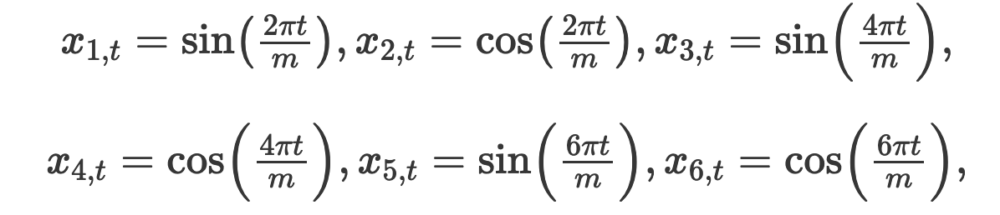

```{r Setup, include = F}
options(htmltools.dir.version = FALSE)
library(pacman)
p_load(broom, latex2exp, ggplot2, ggthemes, ggforce, viridis, dplyr, magrittr, knitr, parallel, xaringanExtra, tidyverse, sjPlot, showtext, mathjaxr, ggforce, furrr, kableExtra, wooldridge, hrbrthemes, scales, ggeasy, patchwork, janitor, tsibble, lubridate, fpp3, MetBrewer)


# Knitr options
opts_chunk$set(
  comment = "#>",
  fig.align = "center",
  fig.height = 8,
  fig.width = 12.5,
  warning = F,
  dev = "svg",
  message = F,
  dpi=300
)

theme_set(theme_ipsum_rc())

```

```{R, colors, include = F}
# Define pink color
red_pink <- "#e64173"
turquoise <- "#20B2AA"
orange <- "#FFA500"
red <- "#E02C05"
blue <- "#2b59c3"
green <- "#0FDA6D"
grey_light <- "grey70"
grey_mid <- "grey50"
grey_dark <- "grey20"
purple <- "#6A5ACD"
```


# Materials

<br>

.b[Required readings]:

<br>

  - [`Hyndman & Athanasopoulos, ch. 7`](https://otexts.com/fpp3/regression.html)
  
    - sections 7.1&mdash;7.5.


  - [`Hyndman & Athanasopoulos, ch. 10`](https://otexts.com/fpp3/dynamic.html)
  
    - section 10.1.
    


---
class: inverse, middle

# Motivation


---

# Motivation

<br>

After studying .hi[ARIMA] models, we have seen that we *can* (and *should*, when possible) include .hi-slate[information from past observations of a series] for modeling/forecasting purposes.

--

However, one .hi-red[limitation] of such models is that they do not allow for the inclusion of .hi-blue[exogenous factors].

--

<br>

By .hi-blue[exogenous] factors we mean including other .hi-red[explanatory variables] that may be relevant to model and forecast a variable's behavior over time.

--

To this end, we turn our attention to .hi-slate[dynamic regression models].


---
class: inverse, middle

# Time-series regression models

---

# Time-series regression models

When applied to *time series data*, a .hi-blue[regression model] looks like the following:

<br>

$$
\begin{aligned}
y_t = \beta_0 + \beta_1x_{1t} + \beta_2x_{2t} + \cdot \cdot \cdot + \beta_kx_{kt} + \varepsilon_t   
\end{aligned}
$$

--

<br>

In words, the .hi-red[dependent] variable $y_t$ is a .hi-slate[linear function] of *k* .hi-blue[predictor/independent] variables, as well of a .hi-red[stochastic] error term $(\varepsilon_t)$, which is assumed to be .hi[white noise] and .hi-orange[uncorrelated] with the RHS variables.

--

However, when it comes to time series data, .hi-blue[residual autocorrelation] is a common *issue*.

--

To *overcome* that issue, one *alternative* is to incorporate such serial correlation into our residuals through .hi-slate[ARIMA modeling].

---
class: middle, inverse

# The basics

---

# The basics

<br>

Starting from a .hi-blue[simple regression model]:


<br><br>

$$
\begin{aligned}
\text{Consumption}_t = \beta_0 + \beta_1\text{Disposable Income}_t + \varepsilon_t
\end{aligned}
$$

---

# The basics

```{r, echo=F}
dat <- read_csv("fredgraph.csv") |> 
  clean_names() |> 
  rename(cons = pcec96,
         inc = dspic96)

dat_ts <- dat |> 
  mutate(date = yearmonth(date)) |> 
  as_tsibble(index = date)

dat_ts |> 
  ggplot(aes(x = date, y = cons)) +
  geom_line(aes(color = "Real personal consumption")) +
  geom_line(aes(y = inc, color = "Real disposable income")) +
  scale_color_manual(values = c("#2a5fac", "#ec5c11")) +
  labs(y = "Billions of dollars (2017)",
       x = "",
       title = "U.S. real personal consumption and real disposable income",
       subtitle = "01/2007-02/2024",
       caption = "Source: U.S. Bureau of Economic Analysis (BEA).") +
  easy_legend_at("top") +
  easy_add_legend_title("") +
  easy_plot_legend_size(13) +
  easy_y_axis_title_size(13) +
  easy_plot_caption_size(13)

```


---

# The basics

```{r, echo=F}
dat_ts |> 
  ggplot(aes(x = inc, y = cons)) +
  geom_point(shape = 21, size = 1.9) +
  #geom_smooth(method = "lm", se = F, color = "#4a2956") +
  labs(y = "Consumption",
       x = "Disposable income",
       title = "U.S. real personal consumption and real disposable income",
       subtitle = "01/2007-02/2024",
       caption = "Source: U.S. Bureau of Economic Analysis (BEA).") +
  easy_y_axis_title_size(13) +
  easy_x_axis_title_size(13) +
  easy_plot_caption_size(13)

```


---

# The basics

```{r, echo=F}
dat_ts |> 
  ggplot(aes(x = inc, y = cons)) +
  geom_point(shape = 21, size = 1.9) +
  geom_smooth(method = "lm", se = F, color = "#4a2956") +
  labs(y = "Consumption",
       x = "Disposable income",
       title = "U.S. real personal consumption and real disposable income",
       subtitle = "01/2007-02/2024",
       caption = "Source: U.S. Bureau of Economic Analysis (BEA).") +
  easy_y_axis_title_size(13) +
  easy_x_axis_title_size(13) +
  easy_plot_caption_size(13)

```


---
class: clear


In .mono[R], the `{fable}` package handles linear regression through the `TSLM()` function.

```{r}
dat_ts |> 
  model(reg = TSLM(cons ~ inc)) |> 
  report()
```

```{r, echo=F}
reg_fit <- dat_ts |> 
  model(reg = TSLM(cons ~ inc))
```


---

class: clear

```{r}
reg_fit |> gg_tsresiduals()
```


---

# The basics

Are the residuals .hi-slate[white noise]?

```{r}
reg_fit |> 
  augment() |> 
  features(.innov, ljung_box, lag = 10)
```


---
class: inverse, middle

# Useful predictors


---

# Useful predictors

When a time series shows .hi-blue[trend] and/or .hi-red[seasonality], one good *first step* may be .hi-red[explicitly] incorporating these features on a regression's right-hand side.

--

A .hi-slate[linear trend] may be modeled in the following way:

<br>

$$
\begin{aligned}
y_t = \beta_0 + \beta_1t + \varepsilon_t   
\end{aligned}
$$

<br>

where *t = 1, 2, ..., T*.

---
class: clear

```{r}
dat_ts |> 
  model(reg_trend = TSLM(cons ~ trend())) |> 
  report()


```


---

# Useful predictors

```{r, echo=F}

dat_ts |> 
  model(reg_trend = TSLM(cons ~ trend())) |> 
  augment() |> 
  ggplot(aes(x = date, y = cons)) +
  geom_line(aes(color = "Personal consumption"), linewidth = .7) +
  geom_line(aes(y = .fitted, color = "Fitted values")) +
  scale_color_manual(values = c("#77003c", "#32af6f")) +
  labs(y = "Personal consumption",
       x = "") +
  easy_plot_legend_size(13) +
  easy_add_legend_title("") +
  easy_y_axis_title_size(13) +
  easy_legend_at("top")

```


---

# Useful predictors

.hi-red[Seasonality] can be easily handled with the use of .hi-slate[dummy (binary)] variables.

--

The idea is to .hi-blue[encode] specific seasonal periods with either *1* or *0* values.

--

  - In .mono[R], the `TSLM()` function takes care of seasonal dummies for us.

--

<br><br>

In terms of .hi-blue[interpretation], each of the coefficients associated with the dummy variables is a measure of the effect of *that category* .hi-slate[relative to] the *omitted* category.

---

# Useful predictors

```{r, echo=F}
recent_production <- aus_production |>
  filter(year(Quarter) >= 1992)
recent_production |>
  autoplot(Beer, linewidth = .6) +
  labs(y = "Megaliters",
       title = "Australian quarterly beer production")
```


---

class: clear

```{r}
recent_production |> 
  model(reg_season = TSLM(Beer ~ season())) |> 
  report()
```


---

class: clear

```{r}
recent_production |> 
  model(reg_season = TSLM(Beer ~ trend() + season())) |> 
  report()
```


---

# Useful predictors

```{r, echo=F}

recent_production |> 
  model(reg_season = TSLM(Beer ~ trend() + season())) |> 
  augment() |> 
  ggplot(aes(x = Quarter, y = Beer)) +
  geom_line(aes(color = "Beer production"), linewidth = .7) +
  geom_line(aes(y = .fitted, color = "Fitted values")) +
  scale_color_manual(values = c("#77003c", "#32af6f")) +
  labs(y = "Megaliters",
       x = "") +
  easy_plot_legend_size(13) +
  easy_add_legend_title("") +
  easy_y_axis_title_size(13) +
  easy_legend_at("top")

```


---

# Useful predictors


```{r}
recent_production |> 
  model(reg_season = TSLM(Beer ~ trend() + season())) |> 
  augment() |>
  features(.innov, ljung_box, lag = 2 * 4)
```


<br><br>

Are residuals .hi-slate[white noise]?

---

# Useful predictors

An alternative way of .hi-blue[modeling seasonality] is to incorporate .hi-red[Fourier terms].

--

These are *sine* and *cosine* terms used to approximate .hi-slate[periodic functions].

--

As time series show *periodic* behavior, Fourier terms are well-suited for .hi-red[seasonal series].


--

<br>

If *m* is the seasonal period, then the first few Fourier terms are given by 

<br>

.center[

]


---

# Useful predictors

<br>

The .hi-red[maximum] number of Fourier terms allowed is given by *K = m/2*, where *m* is the number of seasonal periods in a year.

--

<br>

A regression model containing Fourier terms is often called a .hi-slate[harmonic regression]. 

---

# Useful predictors

```{r, echo=F}
air <- read_csv("air_passengers.csv")


air_ts <- air |> 
  mutate(date = yearmonth(date)) |> 
  as_tsibble(index = date)

air_ts |> 
  ggplot(aes(x = date, y = passengers)) +
  geom_line() +
  labs(title = "International airline passengers",
       subtitle = "Jan 1949 – Dec 1960",
       caption = "Source: Brown (1962).",
       x = "",
       y = "Thousands") +
  easy_y_axis_title_size(14) +
  easy_plot_caption_size(14)

```

---
class: clear

.smallest[
```{r}
air_ts |> 
  model(reg = TSLM(log(passengers) ~ trend() + season())) |> 
  report()
```
]


---

# Useful predictors

```{r, echo=F}
air_ts |> 
  model(reg = TSLM(log(passengers) ~ trend() + season())) |>
  augment() |> 
  ggplot(aes(x = date, y = passengers)) +
  geom_line(aes(color = "Air passengers")) +
  geom_line(aes(y = .fitted, color = "Fitted values"), linewidth = 0.8) +
  scale_color_manual(values = c("#77003c", "#32af6f")) +
  labs(y = "Passengers",
       x = "") +
  easy_plot_legend_size(13) +
  easy_add_legend_title("") +
  easy_y_axis_title_size(13) +
  easy_legend_at("top")

```


---

# Useful predictors

.smallest[
```{r}
air_ts |> 
  model(reg = TSLM(log(passengers) ~ trend() + fourier(K = 2))) |> 
  report()
```
]

---

# Useful predictors

```{r, echo=F}
air_ts |> 
  model(reg = TSLM(log(passengers) ~ trend() + fourier(K = 2))) |>
  augment() |> 
  ggplot(aes(x = date, y = passengers)) +
  geom_line(aes(color = "Air passengers")) +
  geom_line(aes(y = .fitted, color = "Fitted values"), linewidth = 0.8) +
  scale_color_manual(values = c("#77003c", "#32af6f")) +
  labs(y = "Passengers",
       x = "", 
       title = "Using K = 2") +
  easy_plot_legend_size(13) +
  easy_add_legend_title("") +
  easy_y_axis_title_size(13) +
  easy_legend_at("top")

```


---

# Useful predictors

.smallest[
```{r}
air_ts |> 
  model(reg = TSLM(log(passengers) ~ trend() + fourier(K = 4))) |> 
  report()
```
]

---

# Useful predictors

```{r, echo=F}
air_ts |> 
  model(reg = TSLM(log(passengers) ~ trend() + fourier(K = 4))) |>
  augment() |> 
  ggplot(aes(x = date, y = passengers)) +
  geom_line(aes(color = "Air passengers")) +
  geom_line(aes(y = .fitted, color = "Fitted values"), linewidth = 0.8) +
  scale_color_manual(values = c("#77003c", "#32af6f")) +
  labs(y = "Passengers",
       x = "", 
       title = "Using K = 4") +
  easy_plot_legend_size(13) +
  easy_add_legend_title("") +
  easy_y_axis_title_size(13) +
  easy_legend_at("top")

```


---

# Useful predictors

.smallest[
```{r}
air_ts |> 
  model(reg = TSLM(log(passengers) ~ trend() + fourier(K = 6))) |> 
  report()
```
]

---

# Useful predictors

```{r, echo=F}
air_ts |> 
  model(reg = TSLM(log(passengers) ~ trend() + fourier(K = 6))) |>
  augment() |> 
  ggplot(aes(x = date, y = passengers)) +
  geom_line(aes(color = "Air passengers")) +
  geom_line(aes(y = .fitted, color = "Fitted values"), linewidth = 0.8) +
  scale_color_manual(values = c("#77003c", "#32af6f")) +
  labs(y = "Passengers",
       x = "", 
       title = "Using K = 6") +
  easy_plot_legend_size(13) +
  easy_add_legend_title("") +
  easy_y_axis_title_size(13) +
  easy_legend_at("top")

```

---
class: inverse, middle

# ARIMA errors

---

# ARIMA errors

In case we have evidence of residual serial correlation, we may write a time-series regression model as follows:

--

$$
\begin{aligned}
y_t = \beta_0 + \beta_1x_{1t} + \beta_2x_{2t} + \cdot \cdot \cdot + \beta_kx_{kt} + \eta_t   
\end{aligned}
$$

<br>

where $\eta_t$ is assumed to be .hi-orange[autocorrelated], and follows an .hi-slate[ARIMA] process.

--

For instance, if $\eta_t$ follows an .b[ARIMA(1, 1, 1)] process, it can be expressed as

$$
\begin{aligned}
\eta_t' = c + \phi_1\eta_{t-1}' + \theta_1\varepsilon_{t-1} + \varepsilon_t   
\end{aligned}
$$

where $\varepsilon_t$ follows a white-noise process.


---

# ARIMA errors

<br>

Now, the model has .hi-slate[two error terms]:

<br>

--

  1. The error from the *regression model*, which we denote by $\eta_t$; and
  
  2. The error term from the *ARIMA* model, which we denote by $\varepsilon_t$.

--

<br><br>

Only $\varepsilon_t$ is assumed to be white noise here.


---

# ARIMA errors

Whenever a regression's .hi-slate[error term] shows .hi-orange[serial correlation], several problems arise:

--

  - As relevant information is left to the error term, the model is **not well specified**;
  
    - ***Autocorrelation is information!***
    
  - Inference is unreliable;
  
    - *p-values*, *t-statistics* are **biased**.
    
--

<br>

Therefore, applying .hi-red[Ordinary Least Squares] (OLS) estimation in models with residual autocorrelation is .hi-blue[problematic].

--


Instead, we should .hi-slate[model] the autocorrelations in the residual term, so we incorporate such information into our modeling/forecasting.

  


---

# ARIMA errors

An important .hi-orange[consideration] when estimating a regression with *ARIMA errors* is that all of the variables in the model must first be .hi-blue[stationary].

--

Thus, running a unit-root test (such as KPSS) is .hi[mandatory].

--

One .hi[common practice] is to difference .hi-red[*all*] regression variables if .hi-red[*any*] of them is *non-stationary*.

--

  - The resulting model is then called a “*model in differences*.”

--

<br>

On the other hand, a "*model in levels*" denotes a regression with all included variables being stationary *without* any transformation needed.

---

# ARIMA errors

In .mono[R], the `{fable}` package handles dynamic regression models with the `ARIMA()` function.

--

For example, the code

```{r, eval = F}
ARIMA(y ~ x + pdq(1,1,0))
```

fits a dynamic regression for *y_t*, controlling for one exogenous variable $(x_t)$, assuming that the residual term $\eta_t$ follows an .b[ARIMA(1, 1, 0)] process.

--

<br>

  - Let us write out this model.
  


---
layout: false
class: inverse, middle

# Next time: More on dynamic regression

---
exclude: true


